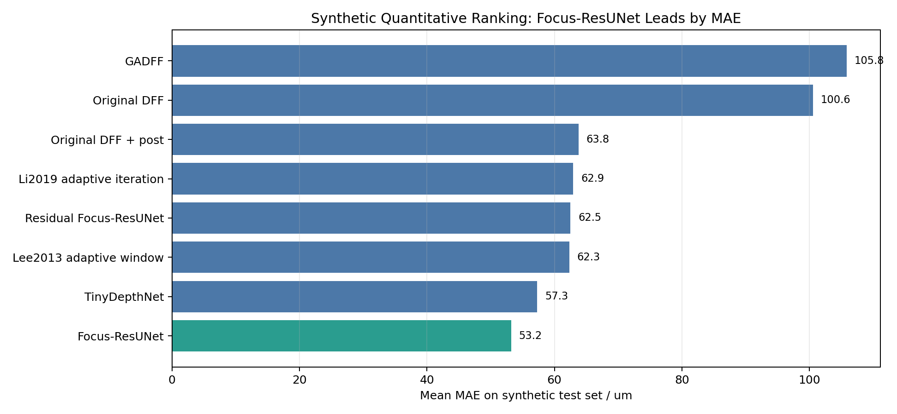
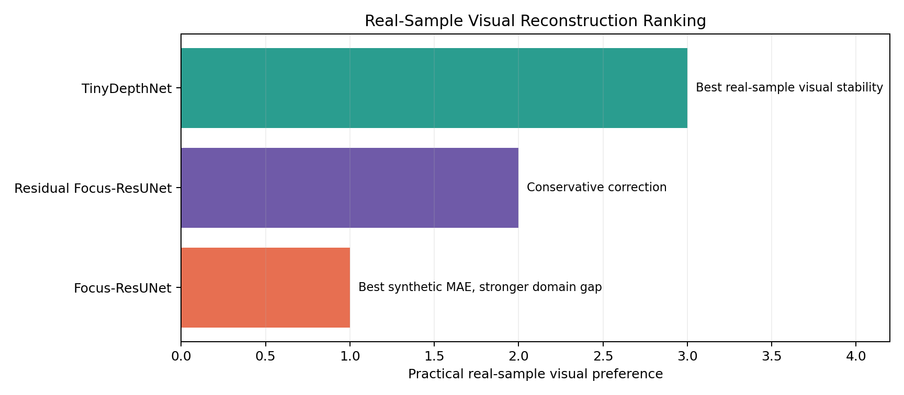

# Focus-Stack DFF Surface Defect Reconstruction

## Overview

This project explores multi-material surface defect visualization using focus-stack imaging, depth-from-focus (DFF), glare-aware reconstruction, and learning-based depth correction. The work combines traditional focus-measure baselines, simulated surface generation, glare-risk modeling, and neural-network experiments for relative 3D surface reconstruction. The public version includes representative comparison figures, technical notes, and reproducible Python scripts for the core simulation and evaluation pipeline.

The public repository is organized as a readable portfolio version. Large raw focus stacks, trained model weights, intermediate experiment folders, Office report or slide files, and complete local delivery packages are documented but excluded from GitHub.

## My Role

- Built and maintained the Python pipeline for synthetic surface generation, focus-stack simulation, DFF reconstruction, glare-aware focus evaluation, and comparison figure generation.
- Implemented the project-wide focus-stack height convention so that the first image in a stack maps to the higher focal plane and later images scan downward.
- Ran algorithm comparison experiments across traditional DFF variants, adaptive-window style baselines, glare-aware DFF, and learning-based correction models.
- Prepared final reports, defense materials, result panels, and technical notes with explicit boundaries between real-sample relative reconstruction and simulated quantitative validation.

## Features

- Synthetic 3D surface generator for ridges, valleys, steps, periodic texture, and rough surfaces.
- Focus-stack simulation with reflectance and glare-risk factors.
- Traditional DFF and glare-aware DFF reconstruction utilities.
- Learning-based depth correction experiments using PyTorch.
- Representative result figures for simulated quantitative comparison and real-sample relative reconstruction.
- Data and model boundary notes for public release.

## Tech Stack

- Python
- NumPy, OpenCV, Matplotlib, Pandas
- PyTorch
- python-docx, python-pptx for report and slide generation
- Depth-from-focus, focus-measure maps, synthetic surface rendering, glare-risk prior modeling

## Repository Structure

```text
.
|-- README.md
|-- .gitignore
|-- LICENSE
|-- requirements.txt
|-- src/
|   |-- dff_depth_direction.py
|   |-- surface_sample_generator.py
|   |-- simulate_antiglare_prototype.py
|   |-- simulate_antiglare_highres_samples.py
|   |-- glare_aware_dff.py
|   |-- run_real_focus_measure_eval.py
|   `-- train_*.py
|-- docs/
|   `-- notes/
|-- assets/
|   `-- figures/
|-- results/
|   `-- figures/
|-- data/
|   `-- README.md
|-- models/
|   `-- README.md
|-- notebooks/
`-- archive_local/
```

## Installation

```bash
python -m venv .venv
.venv\Scripts\activate
pip install -r requirements.txt
```

For GPU experiments, install the PyTorch build that matches the local CUDA environment before running training scripts.

## Usage

Generate a synthetic surface sample:

```bash
python src/surface_sample_generator.py --name demo_surface --baseline v_valley --noise perlin --out results/generated_surface_demo
```

Run the compact anti-glare simulation prototype:

```bash
python src/simulate_antiglare_prototype.py
```

Review the representative results:

- `assets/figures/synthetic_method_ranking_mae.png`
- `assets/figures/real_sample_visual_ranking.png`
- `results/figures/simulation_multisample_algorithm_panel.png`
- `results/figures/real_midterm_multisample_panel.png`

## Results

The project produced relative 3D reconstruction panels for real focus-stack samples and quantitative validation on simulated samples with known height maps. In the organized report assets, the simulated benchmark identifies Focus-ResUNet as the strongest method by average MAE among the tested project variants, while real-sample panels are presented as relative reconstruction and visual defect localization results.





## Data and Model Notes

The complete raw focus stacks, generated datasets, `.npy` arrays, training logs, checkpoints, Office display files, and model weights are excluded from the public repository because of file size, reproducibility boundaries, and project-material constraints. See `data/README.md` and `models/README.md` for details.

## Limitations

- Real-sample results are relative DFF reconstructions, with no public absolute-height calibration dataset included.
- Simulated quantitative metrics depend on synthetic ground-truth surfaces and should be interpreted as controlled validation.
- Training scripts may require local data paths, GPU availability, and larger files stored outside GitHub.
- The public repository keeps the stable, readable project version and archives legacy workspace material locally.

## License

Current materials are provided for academic and portfolio display. A formal open-source license for reusable code and redistribution of documents should be confirmed before public release.
