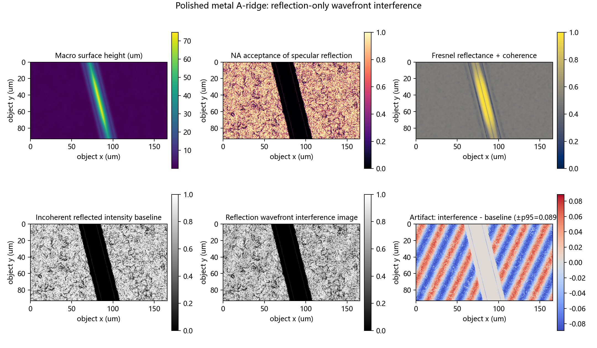
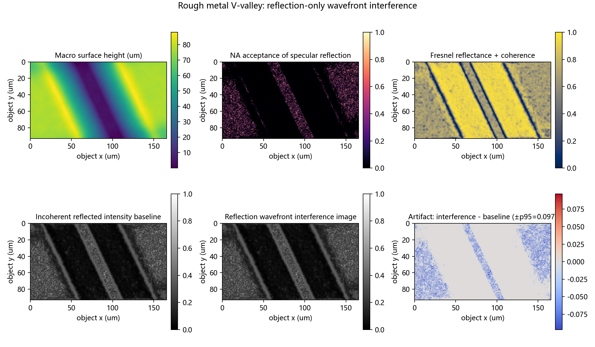
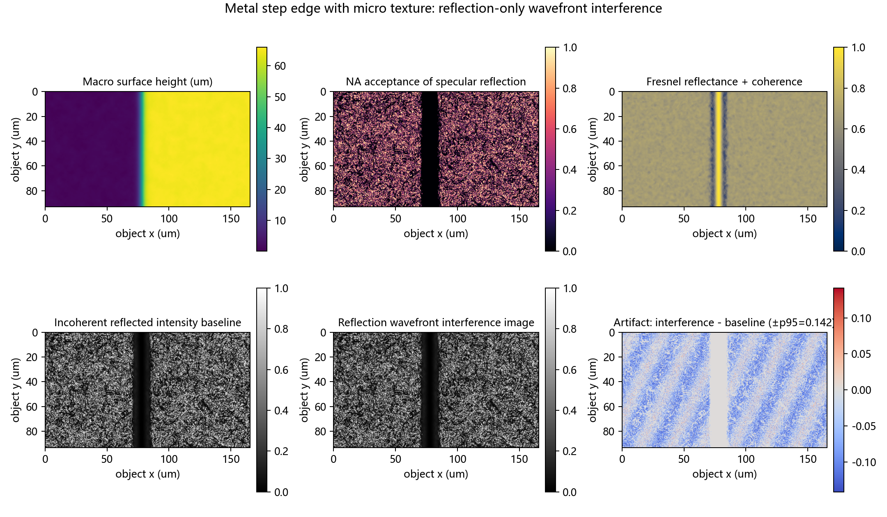

# 金属表面反射波前干涉伪影模拟

## 结论

本轮模拟只回答一个问题：**不使用 PSF 卷积，不模拟透镜衍射像差，只考虑金属表面反射复振幅的相干叠加，是否会产生图像伪影。** 模型使用项目已有 `src/surface_sample_generator.py` 生成 A 型刃脊、V 谷和阶跃三类微结构；宏观高度用于计算局部法线、入射角和物镜 NA 接收权重，纳米到亚微米级残余微起伏用于反射相位。

在 525 nm、NA=0.40、20X、物方采样 0.173 um/pixel 的设置下，反射干涉图相对非相干反射基线产生了 **0.089-0.142** 的 p95 相对强度扰动。伪影主要出现在镜面反射能进入物镜接收锥的位置，以及微粗糙度仍保留一定相干性的区域。这说明：在当前模型条件下，仅金属表面反射波前的相干积分和弱寄生反射，就可以产生条纹状、斑点状或局部亮暗调制伪影。

结论边界需要明确：本报告证明的是“反射波前干涉在模型条件下可产生伪影”，没有声称已经完整复现真实 Olympus 20X 物镜、管镜、LED 光源、相机响应和机械焦扫的全成像链。完整显微焦栈应在下一步加入物镜 pupil、离焦相位、有限光源部分相干和传感器响应。

## 物理模型

### 1. 金属 Fresnel 复反射系数

金属复折射率写作：

$$
\tilde n = n + i\kappa.
$$

其中 $n$ 是折射率实部，$\kappa$ 是消光系数。代码中使用 generic steel-like metal 参数，主要用于验证机理；若后续确认真实金属材料，应替换为对应材料在 525 nm 下的光学常数。

对局部入射角 $\theta$，s/p 偏振 Fresnel 系数为：

$$
r_s = \frac{\cos\theta - q}{\cos\theta + q}, \qquad
r_p = \frac{\tilde n^2\cos\theta - q}{\tilde n^2\cos\theta + q},
$$

$$
q = \sqrt{\tilde n^2 - \sin^2\theta}.
$$

其中 $\theta$ 由表面法线和同轴入射方向决定，$q$ 是金属介质中的传播项。因为当前没有偏振测量，本轮使用未偏振近似：

$$
r = \frac{r_s+r_p}{2}, \qquad
R = \frac{|r_s|^2+|r_p|^2}{2}.
$$

这里 $r$ 用于复振幅传播，$R$ 用于强度反射率统计。

### 2. 粗糙度导致的相干衰减

局部 RMS 粗糙度记为 $\sigma$，反射相干振幅衰减近似为：

$$
C_\sigma = \exp\left[-\frac12\left(\frac{4\pi\sigma\cos\theta}{\lambda}\right)^2\right].
$$

其中 $\lambda=0.525\,\mu m$，$\sigma$ 以微米计。这个公式表达的含义是：表面越粗糙，反射光在一个像素内越容易产生随机相位，镜面相干项越弱，非相干散射项越强。

### 3. 反射波前相位

固定同轴照明下，局部残余高度 $h_r(x,y)$ 造成的反射相位为：

$$
\phi(x,y)=\frac{4\pi h_r(x,y)\cos\theta}{\lambda} + \arg(r).
$$

反射时光程变化是往返路径，因此相位项中出现 $4\pi h_r/\lambda$。$\arg(r)$ 是金属 Fresnel 复反射系数带来的相位。

对应反射复场：

$$
E_r(x,y)=r(\theta)\sqrt{A_{NA}(x,y)}C_\sigma(x,y)e^{i\phi(x,y)}.
$$

其中 $A_{NA}$ 表示镜面反射方向落入物镜 NA 接收锥的权重。它不是透镜 PSF，而是“这片局部金属面反射出来的光有多少能进入物镜”的权重。

### 4. 传感器像素内相干积分

非相干反射基线为：

$$
I_{base}(P)=\frac1N\sum_{x\in P} |E_r(x)|^2 + I_{scatter}.
$$

这里 $P$ 是一个传感器像素对应的物方面小区域，$N$ 是该像素内的超采样点数。这个基线等价于只做强度平均，不保留像素内复振幅相位关系。

反射波前干涉图为：

$$
I_{int}(P)=\mu\left|\frac1N\sum_{x\in P}E_r(x)+E_g(P)\right|^2
+(1-\mu)I_{base}(P)+I_{scatter}.
$$

其中 $E_g$ 是弱寄生反射场，$\mu$ 是空间相干权重。这个式子表达的是：部分相干成分按复振幅相加，非相干成分按强度相加。若 $E_r$ 与 $E_g$ 相位局部匹配，会出现亮纹；若相位相反，会出现暗纹。

伪影定义为：

$$
A(P)=\frac{I_{int}(P)-I_{base}(P)}{\mathrm{mean}(I_{base})}.
$$

这个归一化差分就是图中最后一个子图的来源。正值表示反射干涉让该区域变亮，负值表示变暗，绝对值越大说明反射干涉造成的局部亮暗调制越强。

## 指标

| case_id          |   roughness_rms_nm |   spatial_coherence |   mean_fresnel_reflectance |   mean_coherent_attenuation |   mean_acceptance |   artifact_p95_abs_relative_to_mean |   artifact_p99_abs_relative_to_mean |
|:-----------------|-------------------:|--------------------:|---------------------------:|----------------------------:|------------------:|------------------------------------:|------------------------------------:|
| polished_a_ridge |            18.0000 |              0.4500 |                     0.5640 |                      0.9661 |            0.6183 |                              0.0888 |                              0.1075 |
| rough_v_valley   |            62.0000 |              0.2600 |                     0.5478 |                      0.7016 |            0.0596 |                              0.0968 |                              0.1927 |
| micro_step_edge  |            36.0000 |              0.3400 |                     0.5620 |                      0.8553 |            0.3269 |                              0.1417 |                              0.2023 |

### 指标怎么读

- `roughness_rms_nm`：假设的局部 RMS 粗糙度。数值越大，$C_\sigma$ 越小，相干反射越弱，漫散射/非相干成分越强。
- `spatial_coherence`：空间相干权重 $\mu$。数值越大，复振幅相干叠加占比越高，干涉伪影越容易保留。
- `mean_fresnel_reflectance`：平均 Fresnel 强度反射率，反映金属材料和局部入射角带来的总体反光能力。
- `mean_coherent_attenuation`：平均粗糙度相干衰减。接近 1 表示表面相干镜面分量保留较多，接近 0 表示粗糙度已经强烈破坏相干性。
- `mean_acceptance`：镜面反射方向进入物镜 NA 接收锥的平均权重。数值越大，越多局部金属微面能把反射光送进成像路径。
- `artifact_p95_abs_relative_to_mean`：伪影绝对值的 95 分位数，表示大多数明显伪影的主体强度水平。
- `artifact_p99_abs_relative_to_mean`：伪影绝对值的 99 分位数，表示少数强伪影或极端亮暗调制的尾部水平。
- `high_acceptance_artifact_mean_abs`：高镜面接收区域内的平均伪影强度，用于判断伪影是否集中在更容易进入物镜的反射区域。

从表中可以读出：`micro_step_edge` 的 p95 伪影最高，说明阶跃边缘和微纹理更容易产生局部相位突变和强亮暗调制；`rough_v_valley` 的平均接收权重最低，但 p99 仍高，说明粗糙 V 谷整体进入物镜的镜面反射少，但局部仍可能出现强伪影尖峰；`polished_a_ridge` 的相干衰减最弱、接收权重最高，因此伪影更稳定地分布在刃脊和肩部区域。

## 如何读图

下面三张组合图都是相同的 2×3 排列。每张图的六个子图含义完全一致，只是表面形态和金属粗糙度参数不同。

- **A. Macro surface height (um)**：表面生成器输出的宏观高度图，经超采样到传感器像素的 block mean 后显示。它说明这组仿真的几何对象是什么。
- **B. NA acceptance of specular reflection**：由局部法线计算镜面反射方向，再判断它进入 NA=0.40 物镜接收锥的程度。亮处表示该区域更可能把同轴反射光送入物镜。
- **C. Fresnel reflectance + coherence**：由 Fresnel 反射率和粗糙度相干衰减合成，表示材料反光能力和相干保留能力的综合分布。亮处表示反射强、相干性保留也较多。
- **D. Incoherent reflected intensity baseline**：非相干强度积分基线，即只平均 $|E_r|^2$，不让复振幅发生干涉。它是判断干涉伪影的对照图。
- **E. Reflection wavefront interference image**：反射复场与弱寄生反射复场相干叠加后的图像。它比 D 多出的条纹、斑点或局部亮暗变化，就是反射波前干涉可能引入的成像扰动。
- **F. Artifact: interference - baseline**：将 E 减去 D，再除以 D 的平均强度得到的相对差分图。红色表示干涉增强，蓝色表示干涉削弱，颜色越深说明反射干涉伪影越强。

读图时不要只看 E 图，因为 E 同时包含真实反射结构和干涉扰动。真正用于判断伪影的是 F 图，并且要结合 B 和 C：如果 F 中的强差分集中在 B/C 的亮区，说明伪影与“镜面反射进入物镜 + 相干性保留”有关。

## 图像结果

### 1. `polished_a_ridge`：抛光金属 A 型刃脊

**这张图怎么得到：**  
表面由 `a_ridge` baseline 和弱 Perlin 微纹理生成，宏观高度范围约 74.64 um。金属粗糙度设为 18 nm，因此粗糙度相干衰减较弱，平均 `mean_coherent_attenuation=0.9661`。模型先由高度梯度计算局部法线，再计算 Fresnel 复反射、NA 接收权重和反射相位，最后在每个传感器像素内进行复振幅相干积分，并加入弱寄生反射场。

**每个子图怎么看：**  
A 显示 A 型刃脊的宏观几何，中心刃脊和两侧肩部是主要结构。B 中刃脊附近和较平缓肩部更亮，说明这些区域的镜面反射更容易进入物镜。C 整体较亮，表示抛光表面相干镜面分量保留较多。D 是没有反射干涉时的强度基线，主要反映几何法线造成的反光分布。E 是加入弱寄生反射后的相干图像。F 是关键：刃脊和肩部附近出现局部红蓝调制，说明在高接收、高相干区域，反射波前干涉会把原本平滑的反光结构改写成局部亮暗伪影。

**如何解读结果：**  
该 case 说明，抛光金属表面即使粗糙度很低，也不只是产生“更亮的镜面高光”；由于相干性保留较强，弱寄生反射或像素内相干积分可以在刃脊附近制造可见调制。其 p95 相对伪影为 0.0888，属于稳定但不极端的干涉扰动。

### 2. `rough_v_valley`：粗糙金属 V 谷

**这张图怎么得到：**  
表面由 `v_valley` baseline 和较强 Perlin 粗糙纹理生成，宏观高度范围约 87.95 um。金属粗糙度设为 62 nm，因此平均相干衰减降到 `mean_coherent_attenuation=0.7016`。同样先计算局部法线、Fresnel 反射率、NA 接收权重和反射相位，再生成非相干基线与相干干涉图。

**每个子图怎么看：**  
A 显示 V 谷结构和谷底/谷壁的高度过渡。B 整体偏暗，`mean_acceptance=0.0596`，说明大部分谷壁的镜面反射方向没有进入物镜接收锥。C 比抛光刃脊更暗，说明粗糙度破坏了相干镜面反射。D 中主要能看到非相干反射分布，谷底和局部转折区域仍保留一些反光。E 加入相干项后，整体变化不如抛光刃脊稳定。F 中可见少数局部强差分，这些点对应“虽然整体粗糙、整体接收低，但局部微面仍满足进入物镜和相干保留”的位置。

**如何解读结果：**  
该 case 说明，粗糙表面会削弱整体相干干涉，但不会完全消除局部强伪影。其 p95 相对伪影为 0.0968，p99 达到 0.1927，说明大部分区域干涉较弱，但少数局部区域可能出现明显亮暗尖峰。这和真实粗糙金属样本中“局部异常亮点/暗点”更相似。

### 3. `micro_step_edge`：带微纹理的金属阶跃边缘

**这张图怎么得到：**  
表面由 `step` baseline 和中等强度 Perlin 微纹理生成，宏观高度范围约 65.96 um。金属粗糙度设为 36 nm，平均相干衰减为 `mean_coherent_attenuation=0.8553`，空间相干权重为 0.34。阶跃边缘带来局部法线突变，使反射接收权重和相位在边缘附近快速变化。

**每个子图怎么看：**  
A 显示左低右高或类似阶跃的宏观高度变化。B 中阶跃附近和局部平缓区域较亮，表示这些地方更容易将镜面反射送入物镜。C 显示中等强度的反射与相干保留能力。D 是无干涉基线，阶跃边缘已经有明显亮度变化。E 加入相干项后，边缘附近的亮暗分布发生更明显改变。F 最关键：阶跃边缘和微纹理附近出现强红蓝差分，说明局部相位突变会把反射干涉转化为边缘伪影。

**如何解读结果：**  
该 case 的 p95 相对伪影最高，为 0.1417，p99 为 0.2023。它说明阶跃、刃口、孔边缘这类结构比平缓粗糙面更容易出现反射干涉伪影，因为它们同时具备法线快速变化、局部高反射和相位突变。这一结果对本项目中的孔边缘、钥匙尖头、划痕边缘等真实样本最有解释价值。

## 与上一版的区别

上一版把 Airy PSF、pupil 像差和弱干涉放在同一个系统级模拟中，适合说明“成像链可能接近衍射限制并出现 halo”。本轮去掉了 PSF 和透镜像差，只保留金属表面反射相关项：Fresnel 复反射、NA 接收锥、粗糙度相干衰减、表面残余高度相位、像素内相干积分和弱寄生反射。因此，本轮更直接对应你的问题：**反射本身的波前干涉是否能导致伪影。**

## 后续建议

1. 若能确认金属材料，可把 `n,k` 替换为对应材料在 525 nm 的实测或文献光学常数。
2. 若能测得表面粗糙度 Ra/Rq，可把 `roughness_rms_nm` 从假设量改成实测量。
3. 若要贴近 LED，可用实测 LED 带宽和照明孔径估计 `spatial_coherence`，再做相干性扫描。
4. 若要和真实图比对，应优先比较 artifact map 的空间频率、局部亮暗调制幅度和高反射边缘的条纹方向。
5. 若要进一步复现真实显微焦栈，应在本反射复场之后加入物镜 pupil、离焦相位、有限光源部分相干和传感器响应；这属于完整波动光学焦栈仿真，不应和本报告的反射-only 结论混写。
