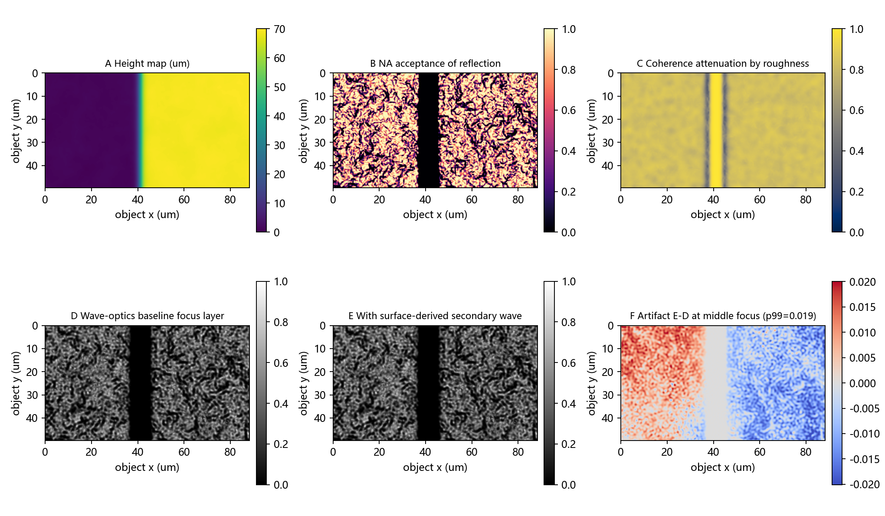
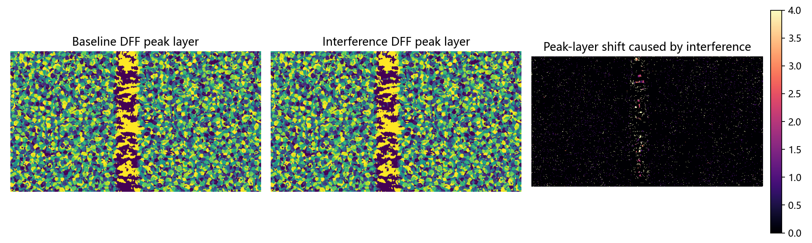
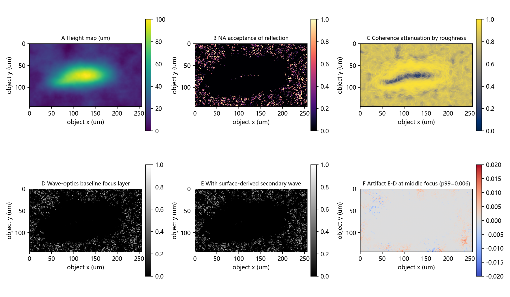
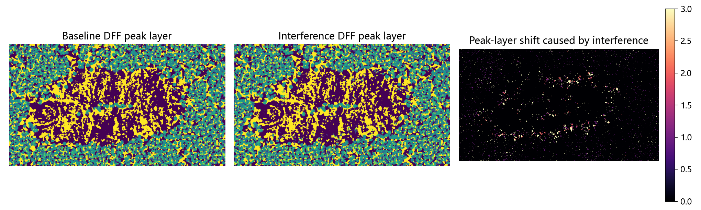
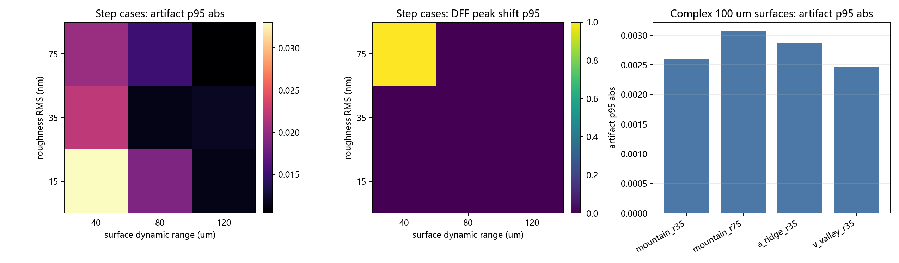

# 轻量波动光学焦栈仿真与复杂 100 um 表面起伏验证

## 本轮问题定义

本轮补充的 100 um 量级起伏指表面高度动态范围，来源是复杂三维面形叠加低频 Perlin 起伏；该高度差不通过整体基线倾斜得到，也不使用尖峰、针孔或孤立像素级突变来制造。新增 case 使用 `mountain`、`a_ridge`、`v_valley` 三类已有表面生成器逻辑，目的是观察复杂表面反射场中的次级小波相干扰动，并降低弱平面寄生反射带来的规则条纹主导性。

## 存储估计与实际输出

- 运行前估计：单个 `512 x 288 x 17` float32 焦栈约 9.56 MB；baseline/interference 两套焦栈约 19.12 MB。只对路线验证 case 保存完整焦栈，其余 case 仅保存高度、DFF 索引、面板图和指标，预计总输出低于 80 MB。
- 实际输出文件夹大小：56.86 MB。

## 模型链条

```text
surface_sample_generator 生成金属复杂高度场
-> Fresnel 复反射 + 粗糙度相干衰减 + NA 接收权重
-> 主反射复场 E(x,y)
-> 从主反射场低通散射残留构造弱次级小波场
-> circular pupil + defocus phase
-> 17 层焦平面强度图
-> baseline/interference 焦栈差分与 DFF peak-layer shift
```

核心变化是次级场的构造。上一版使用弱平面寄生反射，容易形成规则条纹；本版使用由表面复反射场低通得到的弱散射场，并叠加低频表面相位扰动，使 E-D 的伪影更依赖局部面形、NA 接收和相干保留。

尺度设置：路线验证和阶跃扫描沿用 20X 等效物方像素 `0.1725 um/px`；复杂 100 um 起伏组使用 `0.50 um/px` 的轻量等效窗口，对应约 `256 x 144 um` 的成像区域。该设置用于近似几百微米窗口内的复杂起伏，同时继续保持 512 x 288 的轻量计算规模。`pupil_sampling_ok=True` 表示该采样仍覆盖 NA/lambda 所需的 pupil 截止频率。

## 如何读每张 2 x 3 面板

- A `Height map (um)`：表面生成器输出的高度场。复杂 100 um case 中，这张图用于确认高度动态范围来自局部面形起伏，而非整体倾斜。
- B `NA acceptance of reflection`：根据局部法线计算镜面反射进入 NA=0.40 接收锥的权重。亮区代表更容易被物镜收集的反射区域。
- C `Coherence attenuation by roughness`：由局部粗糙度 RMS 推得的相干衰减。亮区说明相位保留更强，暗区说明微粗糙度更容易破坏相干叠加。
- D `Wave-optics baseline focus layer`：只使用主反射复场传播得到的中间焦平面强度，作为无次级小波干涉的对照。
- E `With surface-derived secondary wave`：主反射复场叠加弱表面派生次级小波后的中间焦平面强度。
- F `Artifact E-D`：E 减 D 得到的差分伪影。红色表示干涉增强，蓝色表示干涉削弱；若图案随复杂面形局部分布变化，说明伪影和表面反射结构相关。

每个 `*_dff_peak_shift.png` 用来读焦点选择影响：左图是 baseline 焦栈的 DFF 峰值层，中图是 interference 焦栈的 DFF 峰值层，右图是二者差值。右图越亮，说明次级小波干涉越可能改变重建算法的焦层判断。

## 路线验证 case

首个验证 case `route_validation_step_mid` 保存了 baseline/interference 两套完整焦栈。其 `artifact_stack_p95_abs=0.0164`，`p95_peak_shift_layers=0.0`，说明轻量波动光学链条可以产生可量化的干涉差分，并可进入 DFF 层级诊断。





## 复杂 100 um 表面起伏 case

新增复杂表面 case 全部取消整体倾斜，通过已有表面生成器的宽峰、宽脊和宽谷结构形成 100 um 高度动态范围。这里的 `roughness_rms_nm` 仍表示纳米级微粗糙度，用于相干衰减；`dynamic_range_um=100` 表示宏观/介观表面起伏幅度。复杂组的等效视场约为 256 x 144 um，符合“几百微米窗口中的 100 um 量级起伏”这一假设。

- `complex_mountain_r35_h100`：mountain 面形，等效窗口 256 x 144 um，动态范围 100 um，伪影 p95=0.0026，DFF 峰值层 p95 偏移=0.0 层，99% 局部坡度=3.17。
- `complex_mountain_r75_h100`：mountain 面形，等效窗口 256 x 144 um，动态范围 100 um，伪影 p95=0.0031，DFF 峰值层 p95 偏移=0.0 层，99% 局部坡度=3.07。
- `complex_a_ridge_r35_h100`：a_ridge 面形，等效窗口 256 x 144 um，动态范围 100 um，伪影 p95=0.0029，DFF 峰值层 p95 偏移=0.0 层，99% 局部坡度=2.48。
- `complex_v_valley_r35_h100`：v_valley 面形，等效窗口 256 x 144 um，动态范围 100 um，伪影 p95=0.0025，DFF 峰值层 p95 偏移=0.0 层，99% 局部坡度=2.19。

代表图：





## 全部指标

| case_id                   | case_family      | baseline_type   |   object_pixel_um |   fov_width_um |   fov_height_um |   roughness_rms_nm |   dynamic_range_um |   rough_aspect_ratio |   height_p99_slope | generator_spike_guard   | pupil_sampling_ok   |   artifact_stack_p95_abs |   artifact_stack_p99_abs |   artifact_directionality_p999 |   p95_peak_shift_layers |
|:--------------------------|:-----------------|:----------------|------------------:|---------------:|----------------:|-------------------:|-------------------:|---------------------:|-------------------:|:------------------------|:--------------------|-------------------------:|-------------------------:|-------------------------------:|------------------------:|
| route_validation_step_mid | route_validation | step            |            0.1725 |        88.3200 |         49.6800 |            36.0000 |            70.0000 |               0.2087 |            20.3518 | True                    | True                |                   0.0164 |                   0.0201 |                        49.6171 |                  0.0000 |
| step_sweep_r15_h040       | step_sweep       | step            |            0.1725 |        88.3200 |         49.6800 |            15.0000 |            40.0000 |               0.0870 |            11.6928 | True                    | True                |                   0.0331 |                   0.0375 |                        66.2310 |                  0.0000 |
| step_sweep_r15_h080       | step_sweep       | step            |            0.1725 |        88.3200 |         49.6800 |            15.0000 |            80.0000 |               0.0870 |            23.2881 | True                    | True                |                   0.0187 |                   0.0228 |                        45.0915 |                  0.0000 |
| step_sweep_r15_h120       | step_sweep       | step            |            0.1725 |        88.3200 |         49.6800 |            15.0000 |           120.0000 |               0.0870 |            34.8542 | True                    | True                |                   0.0114 |                   0.0147 |                        30.5780 |                  0.0000 |
| step_sweep_r35_h040       | step_sweep       | step            |            0.1725 |        88.3200 |         49.6800 |            35.0000 |            40.0000 |               0.2029 |            11.6116 | True                    | True                |                   0.0221 |                   0.0259 |                        45.6652 |                  0.0000 |
| step_sweep_r35_h080       | step_sweep       | step            |            0.1725 |        88.3200 |         49.6800 |            35.0000 |            80.0000 |               0.2029 |            23.2652 | True                    | True                |                   0.0114 |                   0.0159 |                        41.7976 |                  0.0000 |
| step_sweep_r35_h120       | step_sweep       | step            |            0.1725 |        88.3200 |         49.6800 |            35.0000 |           120.0000 |               0.2029 |            34.8626 | True                    | True                |                   0.0118 |                   0.0161 |                        37.8492 |                  0.0000 |
| step_sweep_r75_h040       | step_sweep       | step            |            0.1725 |        88.3200 |         49.6800 |            75.0000 |            40.0000 |               0.4348 |            11.6863 | True                    | True                |                   0.0202 |                   0.0258 |                        36.2602 |                  1.0000 |
| step_sweep_r75_h080       | step_sweep       | step            |            0.1725 |        88.3200 |         49.6800 |            75.0000 |            80.0000 |               0.4348 |            23.2788 | True                    | True                |                   0.0151 |                   0.0199 |                        33.1455 |                  0.0000 |
| step_sweep_r75_h120       | step_sweep       | step            |            0.1725 |        88.3200 |         49.6800 |            75.0000 |           120.0000 |               0.4348 |            34.8553 | True                    | True                |                   0.0104 |                   0.0154 |                        27.9338 |                  0.0000 |
| complex_mountain_r35_h100 | complex_100um    | mountain        |            0.5000 |       256.0000 |        144.0000 |            35.0000 |           100.0000 |               0.0700 |             3.1674 | True                    | True                |                   0.0026 |                   0.0056 |                        11.2280 |                  0.0000 |
| complex_mountain_r75_h100 | complex_100um    | mountain        |            0.5000 |       256.0000 |        144.0000 |            75.0000 |           100.0000 |               0.1500 |             3.0683 | True                    | True                |                   0.0031 |                   0.0067 |                         7.6958 |                  0.0000 |
| complex_a_ridge_r35_h100  | complex_100um    | a_ridge         |            0.5000 |       256.0000 |        144.0000 |            35.0000 |           100.0000 |               0.0700 |             2.4809 | True                    | True                |                   0.0029 |                   0.0058 |                        16.0767 |                  0.0000 |
| complex_v_valley_r35_h100 | complex_100um    | v_valley        |            0.5000 |       256.0000 |        144.0000 |            35.0000 |           100.0000 |               0.0700 |             2.1929 | True                    | True                |                   0.0025 |                   0.0058 |                        14.0795 |                  0.0000 |

指标读法：

- `rough_aspect_ratio`：纳米级微粗糙度 RMS 与物方像素尺寸的比值，用于避免把微粗糙度做成像素级高深尖峰。
- `height_p99_slope`：高度图 99% 局部坡度。复杂面形允许存在较大坡度，但该指标可用于筛查异常针状结构。
- `generator_spike_guard`：当前用宽结构生成复杂表面；若该值为 True，说明 99% 局部坡度没有触发本轮的尖峰保护阈值。
- `pupil_sampling_ok`：当前物方采样是否足以覆盖 `NA/lambda` 的 pupil 截止频率。
- `artifact_stack_p95_abs` 和 `artifact_stack_p99_abs`：焦栈范围内 E-D 差分伪影的主体水平和尾部水平。
- `artifact_directionality_p999`：中间焦平面伪影频谱的高分位峰值。规则条纹通常会抬高该值；复杂表面 case 需要结合 F 图共同判断。
- `p95_peak_shift_layers`：95% 像素处 DFF 峰值层偏移，用于判断干涉是否影响焦层选择。

## 汇总图

左、中图保留阶跃表面的粗糙度/动态范围扫描；右图单独汇总复杂 100 um 表面，避免把复杂面形和阶跃表面混入同一张二维热力图。



## 主要观察

- 阶跃扫描中最高 `artifact_stack_p95_abs` 出现在 `step_sweep_r15_h040`，粗糙度 15 nm，动态范围 40 um。
- 复杂 100 um 表面中最高 `artifact_stack_p95_abs` 出现在 `complex_mountain_r75_h100`，面形为 `mountain`，伪影 p95=0.0031。
- 在复杂面形 case 中，F 图的伪影由局部高度、NA 接收和相干保留共同调制，图案不再主要表现为规则平面波条纹。
- 粗糙度增大会增强相干衰减，但复杂面形也会引入更丰富的局部相位扰动，因此伪影强度不应按单一粗糙度变量作线性解释。

## 结论边界

本轮结果支持一个更具体的判断：在仅考虑反射复场传播和弱表面派生次级小波的轻量模型中，复杂 100 um 级表面起伏可以产生可量化、局部分布的相干伪影，并可能改变 DFF 焦层选择。该结果仍是 simulation probe，尚未包含真实 Olympus 20X 物镜 pupil、LED 空间相干性实测、真实金属 n/k 标定和实测表面轮廓。
