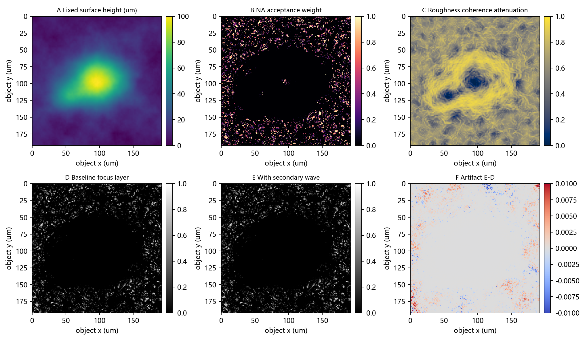
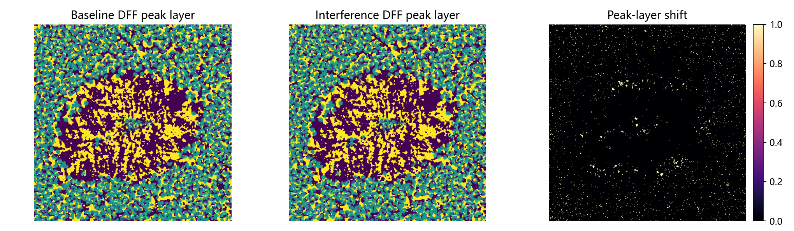

# 开源波动光学路线对比实验

## 实验目的

本实验用于决定后续应优先采用哪条开源波动光学路线。固定变量包括同一复杂 100 um 表面样品、同一金属 Fresnel/粗糙度反射场、同一 NA=0.40、同一波长 525 nm、同一 13 层焦栈和同一 DFF 评价指标。

## 存储与依赖估计

- 单个 float32 焦栈：7.31 MB。
- baseline/interference 两套焦栈：14.62 MB。
- 单个 complex64 复场：1.12 MB。
- 本轮不保存完整焦栈，只保存图、CSV 和报告，预计非依赖输出约 25.0 MB。
- 当前文件夹实际大小：188.14 MB。

依赖可用性：

```json
{
  "python": "D:\\Anaconda\\python.exe",
  "vendor_dir": "D:\\Documents\\Desktop\\projects\\SRTP\\submission_planning\\20260626-202214-open-source-wave-optics-route-benchmark\\vendor",
  "vendor_exists": true,
  "vendor_size_mb": 180.8087682723999,
  "numpy": true,
  "scipy": true,
  "matplotlib": true,
  "pandas": true,
  "torch": true,
  "torchoptics": false,
  "diffractio": false,
  "prysm": true,
  "pyotf": false,
  "psf_generator": false,
  "pySCATMECH": false
}
```

## 路线设置

- `numpy_reference`：本项目自写 angular-spectrum / pupil defocus 参考路线。
- `torch_fft`：使用 PyTorch FFT 实现同一传播核，用于验证 GPU/深度学习工具链接入可行性。
- `prysm_angular_spectrum`：调用 `prysm.propagation.angular_spectrum`，并在传播前使用同一 NA pupil mask，使其和参考路线保持相同接收条件。

`TorchOptics`、`Diffractio`、`pyOTF`、`pySCATMECH` 若未安装，本轮记录为环境缺口。下一轮可在独立 vendor 环境中安装并加入更多独立 API 对比。

## 指标

- `artifact_stack_p95_abs` / `artifact_stack_p99_abs`：baseline 与 interference 焦栈差分伪影强度。
- `artifact_directionality_p999`：中间焦平面伪影频谱高分位峰值，用于观察规则条纹倾向。
- `p95_peak_shift_layers`：DFF 峰值层 95% 分位偏移。
- `runtime_s`：同条件运行耗时。

## 结果表

| route                  | status   | note                                                                          |   runtime_s |   artifact_stack_p95_abs |   artifact_stack_p99_abs |   artifact_directionality_p999 |   mean_peak_shift_layers |   p95_peak_shift_layers |   mean_confidence_baseline |   mean_confidence_interference | panel                                                   | dff_panel                                                        |
|:-----------------------|:---------|:------------------------------------------------------------------------------|------------:|-------------------------:|-------------------------:|-------------------------------:|-------------------------:|------------------------:|---------------------------:|-------------------------------:|:--------------------------------------------------------|:-----------------------------------------------------------------|
| numpy_reference        | ok       |                                                                               |      0.4074 |                   0.0023 |                   0.0049 |                         8.4577 |                   0.0722 |                  0.0000 |                     0.1513 |                         0.1498 | numpy_reference/numpy_reference_panel.png               | numpy_reference/numpy_reference_dff_peak_shift.png               |
| torch_fft              | ok       |                                                                               |      5.0791 |                   0.0023 |                   0.0049 |                         8.4581 |                   0.0720 |                  0.0000 |                     0.1513 |                         0.1498 | torch_fft/torch_fft_panel.png                           | torch_fft/torch_fft_dff_peak_shift.png                           |
| prysm_angular_spectrum | ok       | prysm.propagation.angular_spectrum with same NA pupil mask before propagation |      1.2832 |                   0.0022 |                   0.0048 |                         8.1561 |                   0.0748 |                  0.0000 |                     0.1492 |                         0.1520 | prysm_angular_spectrum/prysm_angular_spectrum_panel.png | prysm_angular_spectrum/prysm_angular_spectrum_dff_peak_shift.png |

## 初步判断

当前同条件实验更适合按研究用途选择路线。`numpy_reference` 最轻、最快，适合作为可解释基线；`torch_fft` 与 NumPy 参考的 artifact p95 差值为 3.49e-08，耗时约为 NumPy 的 12.5 倍。`prysm_angular_spectrum` 可运行，artifact p95 相对 NumPy 参考变化 -2.73% ，耗时约为 NumPy 的 3.1 倍；差异主要来自 prysm 的近轴 angular-spectrum 相位形式。综合判断：论文前仿真的主线建议使用 NumPy/Torch 自控传播核，prysm 作为工程光学交叉验证后端保留；显微 PSF 校准和金属 BRDF 物理应放到下一轮 pyOTF/psf-generator/pySCATMECH 专项。

失败或缺失路线：

无

## 图像说明

每条成功路线的第一张 2 x 3 图中，A 是固定高度图，B 是局部反射进入 NA 的权重，C 是粗糙度相干衰减，D 是无次级小波的基线焦平面，E 是叠加表面派生次级小波后的焦平面，F 是 E-D 差分伪影。第二张图展示 baseline 与 interference 的 DFF 峰值层及其偏移。

### numpy_reference





### torch_fft


### prysm_angular_spectrum


## 下一步路线选择建议

1. 若目标是可控、可解释、可和训练脚本连接，优先扩展 `torch_fft` 或 TorchOptics 路线。
2. 若目标是更接近显微成像 PSF/焦深校准，下一轮应加入 `pyOTF` 或 `psf-generator`。
3. 若目标是金属反射物理可信度，下一轮应单独尝试 `pySCATMECH`，先输出角度相关 Fresnel/BRDF 参数，再接入传播。
4. 若目标是“全视场每个表面点作为子波源，并按方向进入 NA pupil”，需要优先选择支持 Rayleigh-Sommerfeld 或等价全场传播的路线，并在报告中明确采样、pupil、离轴角度和计算代价。
