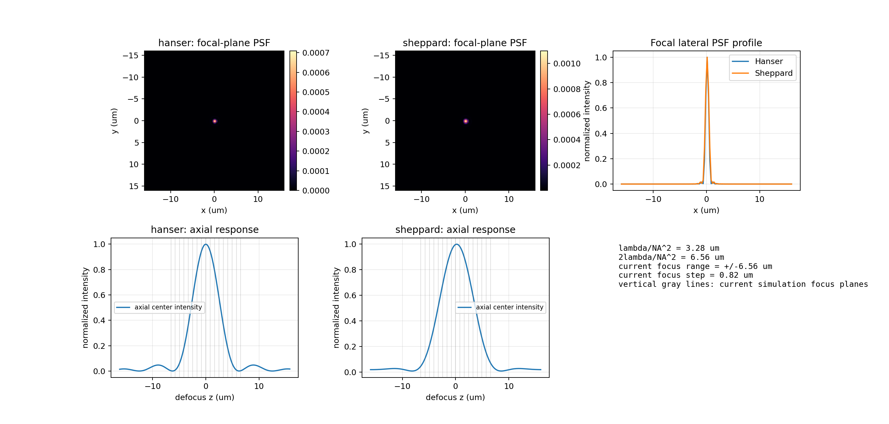

# 显微 PSF 与金属反射开源路线专项探测

## 目的

本轮延续上一轮路线对比，重点探测两个专项：显微 PSF/焦深校准路线，以及金属反射/粗糙散射路线。固定成像条件仍围绕 `lambda=525 nm`、`NA=0.40` 和当前焦栈范围设置。

## 依赖与存储

- `pyOTF`：已用 `--no-deps` 安装到本任务 `vendor_pyotf/`，再补充小依赖 `dphtools`。
- `pySCATMECH`：Windows 当前环境缺少 Microsoft Visual C++ 14.0+，源码扩展编译失败。
- `psf-generator`：dry-run 显示会拉取新版 torch、numpy、scipy、scikit-image 等依赖，下载体积至少约 214 MB，本轮未安装。
- 当前 `vendor_pyotf` 大小：0.59 MB。
- 单个 float64 3D PSF 栈估计：20.12 MB。

## pyOTF PSF 校准结果

本轮使用 `HanserPSF` 与 `SheppardPSF` 生成宽场显微 PSF。参数为：`wl=525 nm`，`NA=0.40`，`ni=1.0`，横向采样 `250 nm`，轴向采样 `200 nm`，轴向范围约 `32 um`。pyOTF 要求当前 NA/波长下的轴向采样小于约 `262.5 nm`，所以本轮没有使用更粗的 `500 nm` 采样。

指标表：

| route          | status   |   wavelength_nm |     NA |     ni |   pixel_size_nm |   z_step_nm |   z_range_um |   axial_fwhm_um |   energy_normalized_sum |   center_peak |   raw_psf_sum_before_normalization |
|:---------------|:---------|----------------:|-------:|-------:|----------------:|------------:|-------------:|----------------:|------------------------:|--------------:|-----------------------------------:|
| pyotf_hanser   | ok       |        525.0000 | 0.4000 | 1.0000 |        250.0000 |    200.0000 |      32.0000 |          5.2000 |                  1.0000 |        0.0007 |                            19.2525 |
| pyotf_sheppard | ok       |        525.0000 | 0.4000 | 1.0000 |        250.0000 |    200.0000 |      32.0000 |          6.8000 |                  1.0000 |        0.0011 |                             0.0011 |

图片说明：

- 左上/中上：Hanser 与 Sheppard 模型在焦平面的横向 PSF。
- 左下/中下：轴向中心强度曲线；灰色竖线是当前轻量波动光学仿真使用的 17 个焦平面。
- 右上：两个模型的焦平面横向强度剖面。
- 右下：当前焦栈范围和 `lambda/NA^2`、`2lambda/NA^2` 的尺度关系。

横向 PSF 在上排看起来接近单点，是因为 `NA=0.40`、`lambda=525 nm` 下焦平面主瓣宽度接近微米级，而图中横向视野显示约 `32 um`；主要信息应从右上剖面和下排轴向曲线读取。

## 判断

`pyOTF` 是本轮最可用的显微 PSF/焦深校准工具，依赖体积小，能直接给出轴向响应曲线。它适合作为当前自写传播核的焦深尺度校验，而不适合直接替代反射表面复场传播。

`pySCATMECH` 物理方向正确，但当前 Windows 环境需要 C++ Build Tools，短期不适合作为快速实验主线。若后续要提高金属反射可信度，可以单独配置编译环境，先用它生成角度相关 Fresnel/BRDF 参数，再接入主传播脚本。

`psf-generator` 可能适合深度学习/PyTorch PSF 生成，但隔离安装成本高。本项目当前已经有自写 Torch FFT 路线，短期优先级低于 `pyOTF` 和 `pySCATMECH`。

## 推荐路线更新

1. 主传播与数据生成：继续使用 NumPy/Torch 自控传播核。
2. 显微焦深校准：加入 `pyOTF` 输出的轴向 PSF 曲线，用于解释焦栈范围和层间距。
3. 金属反射物理：暂时保留 Fresnel + roughness coherence 自写模型；后续在可编译环境中专项尝试 `pySCATMECH`。
4. 全视场子波源进入 NA 的完整性：下一步应在主传播脚本中显式记录 pupil 接收、离轴传播和每点贡献假设，避免只用局部镜面 acceptance 代替全场子波传播。
