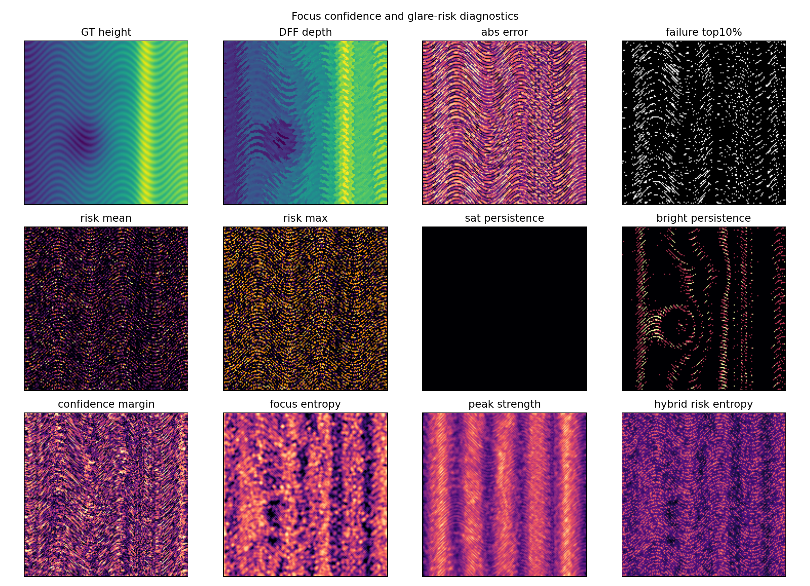
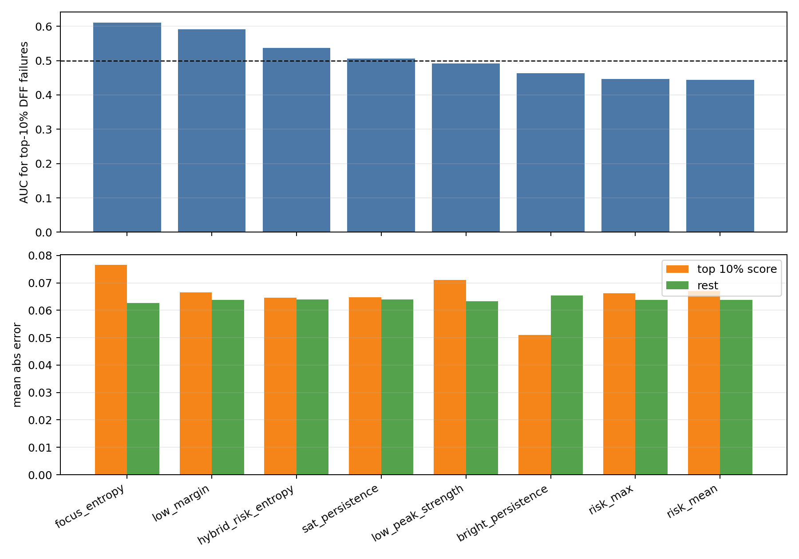

# Focus Confidence 与 Glare Risk 诊断分支报告

日期：2026-06-22  
结果目录：`submission_planning/optical_mechanism_analysis/confidence_risk_branch/`  
脚本：`submission_planning/tools/focus_confidence_risk_study.py`

## 1. 研究问题

前几轮原理分支已经确认，反光微结构的仿真采样方式会影响 glare-risk、焦堆亮度统计和 DFF 深度误差。本轮进一步检查一个更接近论文方法设计的问题：**哪些无参考诊断图能够识别 DFF 容易失败的位置？**

这个问题直接对应后续模型训练策略。若某类诊断图能在没有真实高度标注的情况下定位 DFF 高误差区域，它就可以作为：

- 训练阶段的 loss weighting 或 hard-region mining；
- 真实样本上的 no-reference quality map；
- 高风险 ROI 的自动筛选依据；
- 论文中 flare-aware prior 的可解释支撑。

## 2. 实验设置

实验使用一个合成微结构高度图作为 ground truth，并采用 8x super-resolution integrated simulation：先在高分辨率网格上生成微表面、法线、眩光风险和焦堆，再通过 block-average 积分到传感器分辨率。随后使用 Laplacian focus measure 做传统 DFF 深度选择，并将绝对高度误差最高的 10% 像素定义为 DFF failure top10。

本轮比较的诊断分数包括：

| Score | 含义 |
|---|---|
| `risk_mean` | 子像素 glare risk 的像素平均值 |
| `risk_max` | 像素内最高 glare risk |
| `sat_persistence` | 焦栈中接近饱和的层数比例 |
| `bright_persistence` | 焦栈中高亮层数比例 |
| `low_margin` | 第一、第二 focus response 峰值差距较小的位置 |
| `focus_entropy` | focus response 在焦向上更分散的位置 |
| `low_peak_strength` | 最大 focus response 较弱的位置 |
| `hybrid_risk_entropy` | glare risk、focus entropy 和 saturation persistence 的线性组合 |

评价指标使用 AUC、点二列效应量、top 10% score 区域平均误差、其余区域平均误差，以及 top 10% score 区域中的 failure rate。

## 3. 主要结果

| Score | AUC failure top10 | Effect size | Mean error top10 score | Mean error rest | Failure rate in top10 score |
|---|---:|---:|---:|---:|---:|
| `focus_entropy` | 0.6111 | 0.3826 | 0.0765 | 0.0626 | 0.1434 |
| `low_margin` | 0.5907 | 0.3177 | 0.0665 | 0.0637 | 0.1391 |
| `hybrid_risk_entropy` | 0.5372 | 0.0093 | 0.0646 | 0.0640 | 0.0914 |
| `sat_persistence` | 0.5061 | 0.0000 | 0.0648 | 0.0639 | 0.1039 |
| `low_peak_strength` | 0.4920 | 0.0132 | 0.0710 | 0.0632 | 0.1125 |
| `bright_persistence` | 0.4629 | -0.2971 | 0.0510 | 0.0655 | 0.0238 |
| `risk_max` | 0.4458 | -0.1373 | 0.0662 | 0.0638 | 0.0820 |
| `risk_mean` | 0.4443 | -0.1140 | 0.0669 | 0.0637 | 0.0801 |





## 4. 关键解释

### 4.1 Focus entropy 是本轮最有效的单一失败诊断

`focus_entropy` 对 DFF failure top10 的 AUC 为 0.6111，是本轮最高的单一诊断分数。其 top 10% score 区域平均误差为 0.0765，高于其余区域的 0.0626；failure rate 为 14.34%，也高于 10% 的基准 failure rate。这说明当 focus response 在多个焦层之间分散、峰值选择不明确时，DFF 更容易给出错误深度。

该结果与 DFF 的机制一致。传统 DFF 的核心假设是每个像素存在一个清晰的最佳焦层。如果反光伪边缘、弱纹理或局部过曝使 focus measure 在焦向上出现多个竞争峰，DFF 的 argmax 选择就会变得不稳定。因此，focus entropy 可以被解释为一种“焦向歧义”诊断。

### 4.2 Low margin 提供相近的置信度证据

`low_margin` 的 AUC 为 0.5907，failure rate 为 13.91%。这说明第一、第二 focus response 峰值过近时，DFF 深度选择也更容易出错。相比 `focus_entropy`，`low_margin` 更直接描述 argmax 选择的竞争强度，适合作为 DFF confidence map 或 loss weighting 的组成部分。

### 4.3 单纯 glare risk 不能直接当成失败掩码

本轮中 `risk_mean` 和 `risk_max` 的 AUC 低于 0.5，说明当前 synthetic setting 下，几何反光风险并没有直接等价于 DFF 高误差区域。这个结果很重要：它提示论文中不能把 glare-risk map 简化为 failure mask。更合理的解释是，glare risk 描述的是“容易产生反光异常的物理条件”，而 DFF 是否失败还取决于焦向响应、纹理强度、饱和持续性、局部形貌和采样过程。

因此，glare risk 更适合与 focus confidence 组合使用：

```text
Q_fail(x) = alpha * H_focus(x)
          + beta  * (1 - M_focus(x))
          + gamma * P_sat(x)
          + delta * R_glare(x)
```

其中 `H_focus` 表示 focus entropy，`M_focus` 表示 confidence margin，`P_sat` 表示 saturation persistence，`R_glare` 表示几何 glare risk。权重应通过合成验证集或少量人工 ROI 标注校准，而不宜手工固定。

### 4.4 饱和持续性在本轮较弱，但仍保留真实样本价值

`sat_persistence` 接近随机水平，主要原因是本轮合成曝光条件下持续饱和并不强。该结果不能否定饱和信息在真实样本中的价值。实际显微图像中，钥匙纹路等反光样本可能出现局部焦层过曝、边缘亮度迁移和传感器截断。对真实样本而言，`sat_persistence` 和 `bright_persistence` 仍应作为数据检查和 ROI 筛选指标。

## 5. 对论文方法设计的影响

### 5.1 Flare-aware prior 应升级为 quality-aware prior

当前证据支持把先验从单一的 `glare risk` 扩展为更稳健的 `quality-aware prior`。它包含两层含义：

- 物理层：表面法线、同轴照明和观测孔径决定哪里容易产生反光风险；
- 信号层：focus entropy、confidence margin 和 saturation persistence 决定 DFF 在哪里缺乏可靠焦向证据。

这种表达比单独强调 glare risk 更稳妥，也更贴近训练策略。论文中可以使用 “flare-aware and focus-confidence guided reconstruction” 作为方法描述。

### 5.2 训练策略可改为分区加权

后续模型训练可以增加一个质量图 `Q_fail`，用于提高 DFF 不可靠区域的监督权重：

```text
L = mean( (1 + lambda * Q_fail) * |H_pred - H_gt| )
```

其中 `Q_fail` 可以由 synthetic stack 直接计算，也可以在真实焦栈上无参考生成。这样，模型不只是学习平均误差最小化，还会更关注反光伪边缘、焦向歧义和局部过曝区域。

### 5.3 真实样本评估应增加 no-reference 诊断图

真实样本缺少逐像素高度真值时，仍可输出 `focus_entropy`、`low_margin`、`sat_persistence` 和 `glare risk` 作为质量诊断图。它们可以帮助说明模型在真实样本上的改进是否发生在 DFF 本来不可靠的位置，也可以作为论文可视化的一部分。

## 6. 局限与下一步

本轮结果仍是合成环境中的单次实验，不能直接作为最终统计结论。下一步应做三类补强：

1. 在多组随机微结构、不同粗糙度、不同 exposure 和不同反射强度下重复统计。
2. 在真实焦栈 ROI 上检查 focus entropy、low margin 与可见伪边缘、过曝边缘、DFF 毛刺之间的对应关系。
3. 将 `Q_fail` 接入训练或后处理，验证它是否能实际降低高风险区域 MAE、P90 error 和尖峰数量。

## 7. 可直接写入论文的表述

### 中文

为了避免将反光风险图直接等同于重建错误区域，本文进一步从焦向响应可靠性的角度构造质量诊断图。具体而言，我们计算每个像素的 focus response entropy、top-2 focus margin 和 saturation persistence，并将传统 DFF 误差最高的 10% 像素作为失败区域进行分析。结果显示，focus entropy 对 DFF 失败区域具有最高识别能力，AUC 达到 0.6111；top 10% entropy 区域的平均误差为 0.0765，高于其余区域的 0.0626。这表明 DFF 失败不仅由反光几何风险决定，也与焦向响应歧义密切相关。因此，本文将 flare-risk prior 与 focus-confidence prior 结合，用于训练权重、失败区域诊断和真实样本无参考质量评估。

### English

To avoid treating geometric glare risk as a direct error mask, we further analyze the reliability of the focus response itself. For each pixel, we compute focus-response entropy, top-2 focus margin, and saturation persistence, and evaluate their ability to identify the top 10% DFF error pixels. In the synthetic super-resolution-integrated stack, focus entropy provides the strongest single diagnostic, with an AUC of 0.6111. Pixels in the top 10% entropy region exhibit a mean absolute error of 0.0765, compared with 0.0626 in the remaining region. This result suggests that DFF failures are not determined by glare-prone geometry alone; they are more directly associated with ambiguous or multi-modal focus responses. We therefore combine flare-risk priors with focus-confidence priors for loss weighting, failure-region diagnosis, and no-reference quality assessment on real focus stacks.
