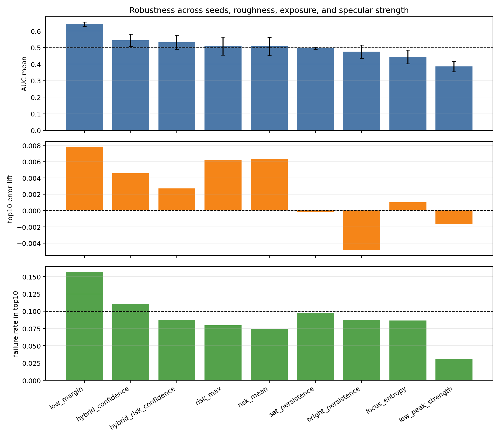
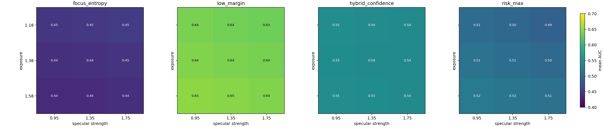

# Focus Confidence 诊断稳健性报告

日期：2026-06-22  
结果目录：`submission_planning/optical_mechanism_analysis/confidence_risk_robustness/`  
脚本：`submission_planning/tools/focus_confidence_risk_robustness.py`

## 1. 研究问题

上一轮单次实验显示 `focus_entropy` 对 DFF failure top10 有一定识别能力，AUC 为 0.6111。但单个 synthetic stack 只能说明一个样例中的现象，不能证明该诊断在不同表面、曝光和反射条件下稳定。因此，本轮实验将 confidence/risk 诊断扩展到多组随机微结构、粗糙度、曝光和镜面反射强度，检查哪些无参考指标真正适合写入论文方法。

核心问题是：

> 在 reflective focus-stack reconstruction 中，DFF 失败区域应主要由几何 glare risk 标识，还是由 focus response 的置信度结构标识？

## 2. 实验设计

实验采用 8x super-resolution integrated simulation。每个条件先在高分辨率微结构上生成 height、normal、glare risk 和 focal stack，再通过 block-average 下采样到 sensor resolution。随后使用 Laplacian focus measure 运行传统 DFF，并把绝对误差最高的 10% 像素作为 DFF failure top10。

参数扫描范围：

| 参数 | 取值 |
|---|---|
| Random seed | 11, 17, 23, 31, 43 |
| Roughness | 0.65, 1.00, 1.35 |
| Exposure | 1.18, 1.38, 1.58 |
| Specular strength | 0.95, 1.35, 1.75 |

总计 135 个 synthetic conditions。每个条件评估 9 类诊断分数，共生成 1215 行 case-level 指标。

诊断分数包括：

- 几何反光风险：`risk_mean`, `risk_max`；
- 过曝/高亮持续性：`sat_persistence`, `bright_persistence`；
- 焦向置信度：`low_margin`, `focus_entropy`, `low_peak_strength`；
- 组合置信度：`hybrid_confidence`；
- 组合风险与置信度：`hybrid_risk_confidence`。

评价指标包括 AUC、AUC>0.5 比例、AUC>0.55 比例、top10 score 区域误差提升量，以及 top10 score 区域中的 failure rate。

## 3. 主要结果

| Score | AUC mean | AUC std | AUC>0.5 | AUC>0.55 | Error lift mean | Failure rate top10 mean |
|---|---:|---:|---:|---:|---:|---:|
| `low_margin` | 0.6412 | 0.0133 | 1.00 | 1.00 | 0.0078 | 0.1568 |
| `hybrid_confidence` | 0.5447 | 0.0364 | 0.95 | 0.40 | 0.0046 | 0.1109 |
| `hybrid_risk_confidence` | 0.5324 | 0.0421 | 0.68 | 0.27 | 0.0027 | 0.0875 |
| `risk_max` | 0.5087 | 0.0540 | 0.46 | 0.16 | 0.0061 | 0.0796 |
| `risk_mean` | 0.5075 | 0.0552 | 0.45 | 0.16 | 0.0063 | 0.0747 |
| `sat_persistence` | 0.4961 | 0.0064 | 0.23 | 0.00 | -0.0002 | 0.0974 |
| `bright_persistence` | 0.4759 | 0.0398 | 0.19 | 0.00 | -0.0049 | 0.0873 |
| `focus_entropy` | 0.4438 | 0.0419 | 0.12 | 0.00 | 0.0010 | 0.0867 |
| `low_peak_strength` | 0.3858 | 0.0315 | 0.00 | 0.00 | -0.0017 | 0.0308 |





## 4. 关键结论

### 4.1 Low margin 是当前最稳定的 DFF failure 诊断

`low_margin` 在 135 个条件上的平均 AUC 为 0.6412，标准差仅 0.0133，并且在所有条件下 AUC 都大于 0.55。它的 top10 score 区域平均 failure rate 为 15.68%，明显高于 10% 的基准 failure rate。这说明当第一、第二 focus response 峰值接近时，DFF 的深度选择更容易出错。

这个结果比单次实验中的 `focus_entropy` 更适合写成论文方法。`low_margin` 与 DFF 的 argmax 决策机制直接对应：如果最高峰和次高峰差距很小，焦层选择对噪声、眩光伪边缘、弱纹理和局部采样扰动都会更敏感。

### 4.2 Focus entropy 不是稳健主指标

单次实验中 `focus_entropy` 表现最好，但多条件扫描后它的平均 AUC 只有 0.4438，且只有 12% 的条件高于 0.5。这说明 entropy 的方向和解释依赖具体 synthetic setting。在某些焦堆中，多峰或分散 response 确实意味着不可靠；但在另一些条件下，entropy 可能也会出现在连续纹理、平滑过渡或非失败区域。

因此，后续论文中不宜把 `focus_entropy` 单独作为主 confidence prior。更稳妥的写法是：entropy 是候选的 focus-curve ambiguity descriptor，而 `top-2 margin` 是当前更稳定的 DFF failure indicator。

### 4.3 几何 glare risk 接近随机，但仍有物理解释价值

`risk_mean` 和 `risk_max` 的平均 AUC 分别为 0.5075 和 0.5087，接近随机排序；两者在不同条件下波动较大，AUC>0.55 的比例只有 16%。这进一步支持上一轮报告的判断：几何 glare risk 不应被直接写成 DFF failure mask。

但 glare risk 仍然有两个价值：

- 它描述表面法线、照明和观测孔径共同决定的反光生成条件；
- 它可以帮助解释为什么某些区域更容易产生高亮、伪边缘或不可恢复的饱和。

因此，risk map 更适合承担 physical prior 和 visualization prior，而 failure weighting 更应依赖 focus confidence。

### 4.4 组合指标需要重新设计

`hybrid_confidence` 平均 AUC 为 0.5447，低于单独的 `low_margin`；`hybrid_risk_confidence` 平均 AUC 为 0.5324，也没有超过 `low_margin`。这说明简单线性组合会引入不稳定信号，尤其当 `focus_entropy` 和 `risk_max` 在部分条件中方向不一致时，组合指标反而会稀释 margin 的稳定性。

后续更合理的方式是采用分层逻辑：

```text
primary confidence: Q_margin = 1 - top2_margin
physical context:   R_glare  = geometry-based glare-risk
data validity:      P_sat    = saturation persistence
```

其中 `Q_margin` 用于训练权重和失败区域诊断，`R_glare` 用于解释反光来源，`P_sat` 用于区分 recoverable 与 unrecoverable glare。

## 5. 对论文方法的修正

上一轮方法表述可以修正为：

```text
Q_fail(x) = alpha * (1 - M_focus(x))
          + beta  * H_focus(x)
          + gamma * P_sat(x)
```

其中 `M_focus` 是 top-2 focus margin，`H_focus` 是 focus entropy，`P_sat` 是 saturation persistence。基于当前稳健性结果，应把 `1 - M_focus` 作为主项，把 entropy 和 saturation persistence 作为辅助项。几何 `R_glare` 不宜直接进入 failure score 的主公式，可以作为条件分区、可视化解释或辅助 gating：

```text
L = mean( (1 + lambda * Q_fail) * |H_pred - H_gt| )
```

论文叙事也应从 “glare risk detects failure” 改为：

> DFF failure is more directly indicated by focus-response ambiguity than by geometric glare risk alone. Geometric glare risk explains where reflective artifacts may originate, while the top-2 focus margin provides a more stable no-reference cue for where DFF depth selection becomes unreliable.

## 6. 局限

本轮实验仍然基于合成焦堆，且当前 surface generator 和 exposure model 只是用于机制验证。结论应限定为：在当前仿真族中，top-2 focus margin 是比 entropy 和 glare risk 更稳定的 failure indicator。后续需要在真实 ROI 上验证：

- `low_margin` 是否与可见 DFF 毛刺、伪边缘、错误深度区域对齐；
- `low_margin` 在不同真实样本和曝光设置下是否稳定；
- 使用 margin-based weighting 后，高风险区域 MAE、P90 error 和 spike count 是否下降。

## 7. 可直接写入论文的表述

### 中文

为了检验质量先验的稳健性，我们在 135 组不同随机表面、粗糙度、曝光和镜面反射强度下评估多种无参考诊断图。结果显示，top-2 focus margin 是最稳定的 DFF 失败区域指示器：`low_margin` 的平均 AUC 为 0.6412，标准差为 0.0133，并在全部条件下超过 0.55。相比之下，几何 glare risk 的平均 AUC 约为 0.51，focus entropy 的平均 AUC 为 0.4438。该结果表明，DFF 失败更直接地对应于焦向响应峰值竞争，而非单纯由反光几何风险决定。因此，本文将 focus-margin confidence 作为训练加权和无参考质量诊断的主信号，将 glare risk 作为物理解释和区域分区先验。

### English

To examine the robustness of the proposed quality prior, we evaluate multiple no-reference diagnostic maps over 135 synthetic conditions with different random surfaces, roughness levels, exposure values, and specular strengths. The top-2 focus margin is the most stable indicator of DFF failure regions: the low-margin score achieves a mean AUC of 0.6412 with a standard deviation of 0.0133, and remains above 0.55 in all tested conditions. In contrast, geometric glare-risk scores are close to random ranking, with a mean AUC of approximately 0.51, while focus entropy is not robust across the parameter sweep. These results suggest that DFF failures are more directly associated with competition among focus-response peaks than with glare-prone geometry alone. We therefore use focus-margin confidence as the primary signal for loss weighting and no-reference quality diagnosis, while retaining glare risk as a physical prior for interpretation and region-wise analysis.
