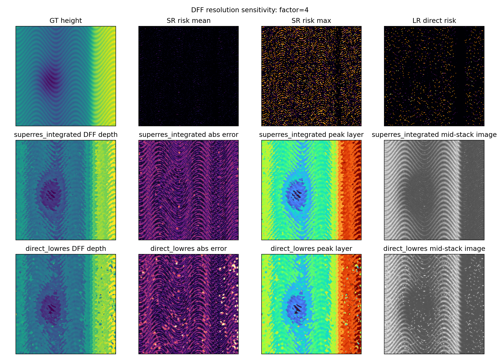
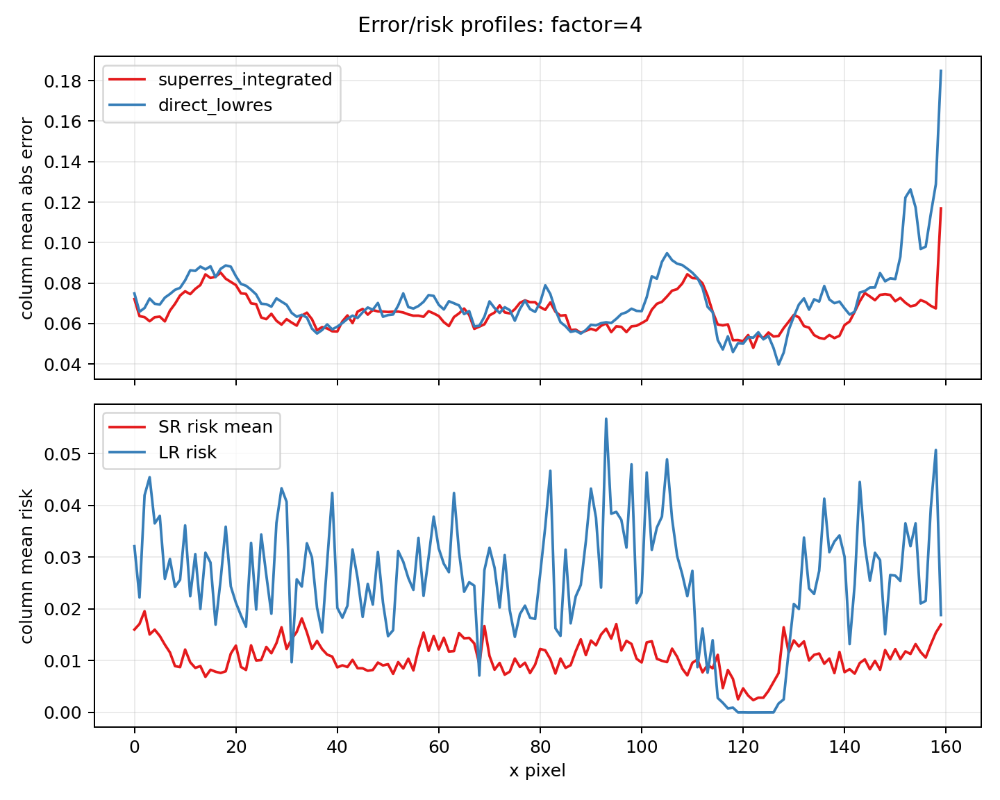

# DFF 分辨率敏感性进一步结果报告

日期：2026-06-21  
结果目录：`submission_planning/optical_mechanism_analysis/dff_resolution_study/`  
脚本：`submission_planning/tools/superres_dff_resolution_study.py`

## 1. 研究问题

上一轮超分辨下采样分支已经显示，直接低分辨仿真会改变 glare-risk、p99 intensity 和近饱和比例。本轮进一步检查：**这种仿真采样差异是否会继续传导到传统 DFF 深度选择和深度误差。**

这一步更接近论文实验，因为 DFF 的最终输出不是亮度图，而是每个像素选择的最佳焦层或深度。

## 2. 实验设置

实验使用同一个合成微结构高度图作为 ground truth，比较两条路径：

| 路径 | 说明 |
|---|---|
| `superres_integrated` | 在高分辨率上生成微表面、计算法线、眩光风险和焦堆，再下采样到 sensor resolution |
| `direct_lowres` | 将高度图降到 sensor resolution 后再计算法线、眩光风险和焦堆 |

每组生成 25 层焦堆，并使用 Laplacian focus measure 做传统 DFF 深度选择。评估指标使用归一化高度误差：

- MAE；
- RMSE；
- P90 error；
- edge MAE；
- high-risk MAE；
- peak layer mean。

## 3. 主要结果

| Factor | Mode | MAE | RMSE | P90 | Edge MAE | High-risk MAE | Peak layer mean | Risk mean |
|---:|---|---:|---:|---:|---:|---:|---:|---:|
| 2 | superres_integrated | 0.0696 | 0.0827 | 0.1224 | 0.0705 | 0.0804 | 12.49 | 0.0150 |
| 2 | direct_lowres | 0.0688 | 0.0878 | 0.1216 | 0.0628 | 0.0914 | 12.46 | 0.0216 |
| 4 | superres_integrated | 0.0654 | 0.0759 | 0.1162 | 0.0719 | 0.0686 | 12.58 | 0.0108 |
| 4 | direct_lowres | 0.0717 | 0.0913 | 0.1247 | 0.0659 | 0.0963 | 12.54 | 0.0254 |
| 8 | superres_integrated | 0.0624 | 0.0717 | 0.1118 | 0.0664 | 0.0624 | 12.43 | 0.0062 |
| 8 | direct_lowres | 0.0748 | 0.0989 | 0.1272 | 0.0651 | 0.1057 | 12.34 | 0.0288 |

### 3.1 全局误差趋势

在 4x 和 8x 下，`superres_integrated` 的 MAE 和 RMSE 都低于 `direct_lowres`。8x 时差异最明显：

- MAE：0.0624 vs 0.0748；
- RMSE：0.0717 vs 0.0989；
- P90：0.1118 vs 0.1272。

这说明采样策略不仅影响亮度统计，也会改变 DFF 深度估计。

### 3.2 高风险区域误差

高风险区域是最关键的观察对象。8x 时：

- `superres_integrated` high-risk MAE = 0.0624；
- `direct_lowres` high-risk MAE = 0.1057。

直接低分辨路径的高风险区域误差约为超分辨积分路径的 1.69 倍。这说明低分辨法线/眩光计算对反光区域尤其敏感。





## 4. 机理解释

### 4.1 数值采样误差会转化为 DFF 深度误差

直接低分辨路径会在 risk map 中制造更强的离散亮点。这些亮点进入合成焦堆后，会改变局部 Laplacian focus measure，使某些像素选择错误的焦层。深度误差图中可以看到，`direct_lowres` 在右侧高反光边缘和散点状高亮区域出现更明显误差尖峰。

### 4.2 超分辨积分的作用不是“平滑”，而是近似像素面积积分

超分辨路径先在子像素微几何上计算反射，再通过 block-average 下采样到 sensor pixel。它保留了像素内部多微面贡献，避免把一个像素误表示为单一低分辨法线。因此，超分辨积分路径中的 risk mean 更低、更连续，DFF 深度图中的散点型错误更少。

### 4.3 Edge MAE 的解释需要谨慎

本实验中 direct low-res 的 edge MAE 有时低于 superres-integrated，这可能说明当前 edge mask 更受几何边缘主导，而 high-risk mask 更能捕捉反光采样误差。投稿时不宜单独强调 edge MAE，应把 high-risk MAE、RMSE、P90 和可视化图一起讨论。

## 5. 对后续研究的直接影响

### 5.1 仿真器应默认采用超分辨积分

建议把当前项目的 synthetic generator 更新为：

```text
4x/8x height_hr
-> normal_hr / glare_risk_hr
-> focus_stack_hr with PSF + exposure clipping
-> block-average or pixel-aperture downsampling
-> height_sensor, stack_sensor, risk_mean_sensor, risk_max_sensor
```

### 5.2 需要新增一个采样策略消融

未来论文可加入一个小型消融表：

| Simulator variant | MAE | RMSE | High-risk MAE | Spike count |
|---|---:|---:|---:|---:|
| direct low-res simulation | 待正式运行 | 待正式运行 | 待正式运行 | 待正式运行 |
| 4x superres + average downsample | 待正式运行 | 待正式运行 | 待正式运行 | 待正式运行 |
| 8x superres + average downsample | 待正式运行 | 待正式运行 | 待正式运行 | 待正式运行 |
| 4x superres + pixel aperture / PSF downsample | 后续扩展 | 后续扩展 | 后续扩展 | 后续扩展 |

### 5.3 新的兴趣点

新的研究分支可以命名为：

**Sampling-Aware Simulation for Reflective Focus-Stack Reconstruction**

核心问题：

> 仿真到真实差距不仅来自光学模型不完整，也来自数值采样策略。对反光微结构而言，错误的采样顺序会制造伪眩光，并改变 DFF 深度选择。

## 6. 可直接写入论文的方法段

### 中文

为降低仿真分辨率对反光响应的影响，本文在高于目标相机分辨率的微几何网格上生成表面高度、法线和眩光风险图，并在该高分辨域内完成离焦、曝光截断和局部反射模拟。随后通过像素面积积分或 block-average 将焦堆下采样到传感器分辨率。该策略避免直接在低分辨网格上估计局部法线造成的伪眩光，使每个传感器像素近似表示其感光面积内多个子像素微面的综合响应。

### English

To reduce grid-dependent artifacts in reflective simulation, the synthetic surface height, normal field, and glare-risk map are generated on a microgeometry grid higher than the target sensor resolution. Defocus, exposure clipping, and local reflectance are simulated in this high-resolution domain before the focal stack is integrated to the sensor resolution by block averaging or a pixel-aperture kernel. This sampling-aware pipeline avoids estimating specular response from a single low-resolution normal and approximates the area-integrated response of subpixel microfacets within each sensor pixel.

## 7. 结论

本轮进一步结果证明，超分辨下采样策略不只是图像仿真的视觉改进，它会影响 DFF 深度选择和高风险区域误差。直接低分辨路径在高风险区域会引入更大的 DFF 误差，尤其在 4x/8x 对比中更明显。因此，后续仿真数据生成、消融实验和论文方法描述都应把 sampling-aware simulation 作为核心设计。
