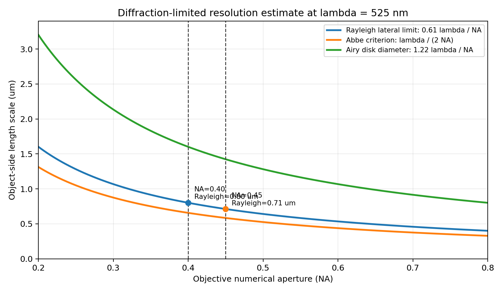
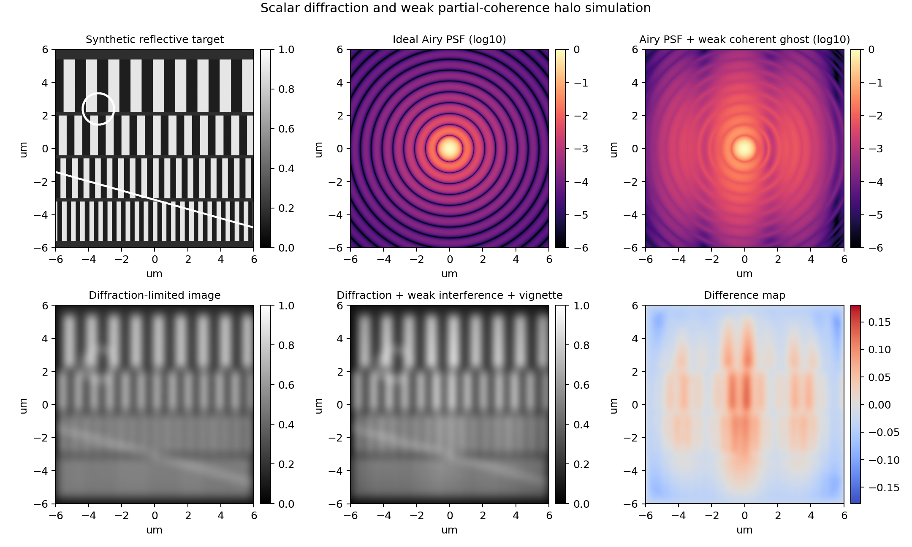

# Olympus 20X + 525 nm 同轴绿光成像的衍射极限与干涉晕影验证

## 结论先行

在把“525mm LED 绿光”按 **525 nm LED 绿光**理解、且 Olympus 20X 物镜型号尚未完全确认的前提下，若物镜 NA 落在 Olympus/Evident 常见 20X 明场/反射物镜的 **0.40-0.45** 区间，则横向 Rayleigh 衍射极限为 **0.71-0.80 um**，Abbe 尺度为 **0.58-0.66 um**。如果相机像元尺寸不超过约 **7.1-8.0 um**，20X 放大后的物方采样满足 Rayleigh Nyquist 条件，系统分辨率主要受物镜 NA 和波长限制。因此，对于 1 um 量级纹理、刃边和微缺陷，当前成像链可以被合理表述为“接近衍射限制”。

干涉晕影部分应写成“物理上可解释且可由模拟复现”，不能只凭 20X、525 nm 和同轴照明三个参数断言真实图像中已经发生了波前干涉。525 nm LED 属于有限带宽、部分相干光源；在同轴照明、反光样本、保护玻璃/分光镜/物镜前表面存在弱寄生反射时，主波前与弱反射波前可形成低对比度调制。该调制叠加 Airy 旁瓣、场边缘照度下降和离焦高亮扩散后，会表现为环状/条纹状 halo、局部 vignette-like shading 或高亮边缘拖尾。

## 参数假设

- 波长：lambda = 525 nm = 0.525 um。
- 物镜：Olympus/Evident 20X 的完整 SKU 和铭牌 NA 尚未提供。本文按常见 20X 空气物镜的 NA=0.40-0.45 区间估算，并把 NA=0.40 和 NA=0.45 作为主分析点；拿到具体型号后只需替换 NA 即可重算。
- 介质：空气，n≈1。
- 采样：相机像元未知，因此给出满足 Nyquist 的最大传感器像元尺寸阈值。
- 光源：按中心波长 525 nm 的窄带 LED 估算；LED FWHM 未实测，报告只做 15-50 nm 量级的部分相干讨论。

## 1. 横向衍射极限推导

显微横向分辨率常用两个尺度：

$$
r_{Rayleigh} = \frac{0.61\lambda}{NA},
\qquad
r_{Abbe} = \frac{\lambda}{2NA}.
$$

Airy 斑第一暗环直径为：

$$
d_{Airy} = \frac{1.22\lambda}{NA}.
$$

代入 lambda=0.525 um 得：

|    NA |   rayleigh_lateral_um |   abbe_lateral_um |   airy_disk_diameter_um |   wave_dof_term_um |   max_sensor_pitch_for_rayleigh_nyquist_um |
|------:|----------------------:|------------------:|------------------------:|-------------------:|-------------------------------------------:|
| 0.300 |                 1.067 |             0.875 |                   2.135 |              5.833 |                                     10.675 |
| 0.400 |                 0.801 |             0.656 |                   1.601 |              3.281 |                                      8.006 |
| 0.450 |                 0.712 |             0.583 |                   1.423 |              2.593 |                                      7.117 |
| 0.500 |                 0.640 |             0.525 |                   1.281 |              2.100 |                                      6.405 |
| 0.600 |                 0.534 |             0.438 |                   1.067 |              1.458 |                                      5.337 |

关键判断：

- NA=0.40 时，Rayleigh 横向极限约 0.801 um，Airy 斑第一暗环直径约 1.601 um。
- NA=0.45 时，Rayleigh 横向极限约 0.712 um，Airy 斑第一暗环直径约 1.423 um。
- 20X 系统若使用 3.45 um 像元，相当于物方 0.173 um/pixel；若使用 5.86 um 像元，相当于 0.293 um/pixel，均细于 Rayleigh Nyquist 阈值。因此多数工业相机配置下，限制项更可能来自物镜衍射/像差/照明，而非像元采样。

## 2. 轴向景深与焦栈影响

MicroscopyU 给出的显微景深近似式为：

$$
d_{tot} = \frac{\lambda n}{NA^2} + \frac{n}{M\cdot NA}e,
$$

其中第一项是波动光学项，第二项与探测器可分辨距离和放大率有关。对 lambda=0.525 um：

- NA=0.40 时，波动项约 3.28 um；若用更宽松的轴向尺度 2lambda/NA^2，则约 6.56 um。
- NA=0.45 时，波动项约 2.59 um；2lambda/NA^2 约 5.19 um。

这说明 20X、NA≈0.40-0.45 的焦栈成像对微米级 z 方向变化非常敏感；高亮边缘、弱纹理、局部饱和和离焦扩散都可能改变 focus measure 的峰值位置。

## 3. 波前干涉与晕影的可解释模型

把主成像场记作 E0，弱寄生反射或弱相干散射项记作 Eg，则传感器强度可写为：

$$
I = |E_0 + \gamma E_g e^{i\Delta\phi}|^2
  = |E_0|^2 + \gamma^2|E_g|^2
  + 2\gamma |E_0||E_g|\cos(\Delta\phi).
$$

相位差可近似写为：

$$
\Delta\phi(x,y) =
\frac{2\pi}{\lambda}OPD(x,y)
+ k_x x + k_y y + \phi_0.
$$

因此，只要反光样本、分光镜、保护玻璃或物镜表面引入小比例寄生场，即使 gamma 只有 0.05-0.15，也会在局部形成百分之几到十几的强度调制。LED 的有限带宽会降低相干可见度，但若光程差落在数微米到十余微米量级，部分相干项仍可能保留。

对两束小角度波前，条纹周期近似为：

$$
p \approx \frac{\lambda}{2\sin(\alpha/2)}.
$$

当 alpha=2°、5°、10° 时，p 分别约为 15.0 um、6.0 um、3.0 um。这些尺度与显微图中的慢变晕影、环状 halo 或局部条纹调制处在同一数量级。

## 4. 模拟结果

模拟采用：

- 理想 Airy PSF：$[2J_1(u)/u]^2$，$u=2\pi NA r/\lambda$。
- 弱寄生相干项：峰值振幅比 0.12，条纹周期 4 um。
- 部分相干可见度：0.10。
- 场照度衰减：约 18% 的二次 vignetting-like roll-off。
- 高反射边缘 halo：对高亮结构做弱宽核扩散。

模拟指标：

- Airy 第一暗环半径：0.801 um。
- 理想 Airy PSF 第一暗环外能量比例：0.145。
- 加入弱寄生场后的第一暗环外能量比例：0.423。
- 合成图中弱干涉/晕影项引入的 p5-p95 强度调制幅度：0.119。

这个结果支持一个更稳妥的表述：衍射旁瓣提供了 halo 的基础空间扩散，弱相干寄生反射提供了条纹/低频调制，场边缘照度下降和反光边缘扩散会让这种调制在真实图像中表现得像晕影或局部光晕。

## 5. 投稿中可使用的表述

建议写法：

> With a 525 nm coaxial green LED and a common Olympus/Evident 20X dry objective (NA≈0.40-0.45), the Rayleigh lateral diffraction limit is estimated to be 0.71-0.80 um. For typical industrial camera pixel pitches below 7-8 um, the object-side sampling after 20X magnification is finer than the Rayleigh Nyquist requirement, indicating that micrometer-scale reflective features are close to the optical diffraction-limited regime. Under coaxial reflective imaging, weak parasitic reflections and partial coherence can further modulate the Airy-limited image, producing halo-like or vignette-like artifacts around high-contrast reflective edges.

中文写法：

> 在 525 nm 同轴绿光和常见 Olympus/Evident 20X 干式物镜 NA≈0.40-0.45 的条件下，Rayleigh 横向衍射极限约为 0.71-0.80 um。若工业相机像元尺寸低于 7-8 um，20X 放大后的物方采样已经细于 Rayleigh Nyquist 要求，微米级反光纹理的可分辨性主要受物镜 NA、波长、像差和照明条件限制。在同轴反射成像中，弱寄生反射和部分相干性会调制 Airy 受限图像，使高对比反光边缘附近出现 halo-like 或 vignette-like artifacts。

## 6. 还需要补充的真实验证

1. 记录物镜完整型号与 NA、相机像元尺寸、管镜倍率、曝光时间、LED 带宽和照明孔径。
2. 用 USAF 1951、chrome-on-glass 分辨率板或亚分辨率荧光/反射微珠测量真实 PSF 和 MTF。
3. 拍摄平场反射样本或镜面样本，检查是否存在固定位置环状晕影、条纹和低频照度场。
4. 改变 LED 波长、光阑/NA、曝光、偏振或轻微倾斜样本。如果 halo 尺度随 lambda/NA 缩放，支持衍射解释；如果条纹周期随倾角或光程改变，支持干涉解释；如果只随视场位置变化，更多指向照明/光路 vignetting。

## 参考来源

- Nikon MicroscopyU, Resolution: https://www.microscopyu.com/microscopy-basics/resolution
- Nikon MicroscopyU, Depth of Field and Depth of Focus: https://www.microscopyu.com/microscopy-basics/depth-of-field-and-depth-of-focus
- Evident Scientific, Objective Finder: https://evidentscientific.com/en/objective-finder
- LightSource.tech, Monochromatic fiber-coupled LED light sources: https://www.lightsource.tech/en/fiber-coupled-light-sources/monochromatic-fiber-coupled-led/
