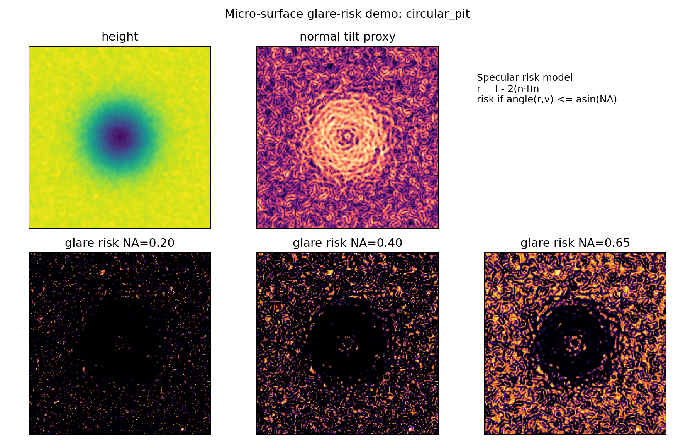
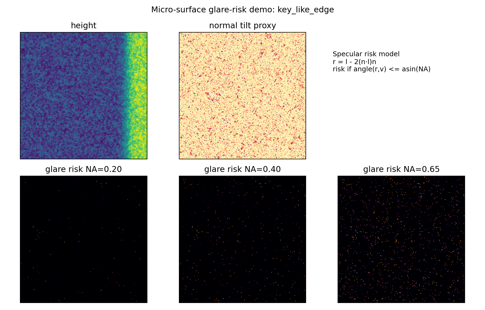

# 法线-接收锥眩光风险最小仿真说明

日期：2026-06-21  
脚本：`submission_planning/tools/glare_risk_microfacet_demo.py`  
输出目录：`submission_planning/optical_mechanism_analysis/glare_sim/`

## 1. 目的

该仿真用于说明一个最小光学机制：反光表面的局部法线会决定镜面反射方向是否进入物镜接收锥。它不是校准渲染器，也不直接拟合真实亮度；它的作用是把“反光风险”从主观图像现象转化为可解释、可视化、可后续消融的物理 prior。

## 2. 模型

给定高度图 `z(x,y)`，先计算局部法线：

```text
n = normalize([-dz/dx, -dz/dy, 1])
```

设入射方向为 `l`，观察方向为 `v`，镜面反射方向为：

```text
r = l - 2(n·l)n
```

物镜接收半角由 NA 决定：

```text
theta_obj = arcsin(NA / n_medium)
```

若 `angle(r,v) <= theta_obj`，该微表面更可能把反射光送入成像路径。仿真中同时输出 soft risk，用于可视化空间连续变化。

## 3. 生成的样本

| surface | 含义 |
|---|---|
| `v_valley` | V 形谷/斜坡缺陷 |
| `circular_pit` | 圆形凹坑缺陷 |
| `rough_ridge` | 粗糙刃脊/突起 |
| `key_like_edge` | 类似钥匙边缘的高反光边界 |

每类样本生成 height、normal tilt proxy，以及 NA=0.20/0.40/0.65 下的 glare-risk map。

## 4. 关键趋势

| Surface | NA=0.20 high-risk | NA=0.40 high-risk | NA=0.65 high-risk | 解释 |
|---|---:|---:|---:|---|
| v_valley | 0.0044 | 0.0169 | 0.0480 | 接收锥变宽后，斜坡中更多微面进入成像路径 |
| circular_pit | 0.0080 | 0.0333 | 0.0955 | 凹坑边缘/粗糙区形成较强局部风险 |
| rough_ridge | 0.0007 | 0.0032 | 0.0091 | 粗糙刃脊局部风险较分散 |
| key_like_edge | 0.0002 | 0.0010 | 0.0030 | 高风险集中在边缘微面，依赖局部法线与照明几何 |

示例图：





## 5. 对论文的用法

该仿真可以支撑方法部分的两个论点：

1. **反光风险有空间结构。** 高亮不应只用全局亮度校正处理，更适合用 height/normal/NA 相关的局部 prior 建模。
2. **NA 和表面微几何都会影响眩光。** 这为后续分区评估、domain randomization 和硬件参数记录提供理由。

建议在正文中谨慎表述为：

> We use a minimal normal-aperture model to estimate glare-prone regions. The model does not aim to render calibrated intensity, but provides a physically interpretable prior indicating where specular reflection is likely to enter the objective acceptance cone.

## 6. 后续补强

| 层级 | 下一步 |
|---|---|
| 最小可行 | 将 glare-risk map 作为 synthetic high-risk mask，报告分区 MAE |
| 中等补强 | 加入有限照明锥、粗糙度随机化和 defocus PSF |
| 强补强 | 用真实样本 ROI 的高亮持久性图反推/拟合风险图 |
| 投稿前 | 把物镜 NA、曝光时间、焦层间距和照明几何写入 metadata |
