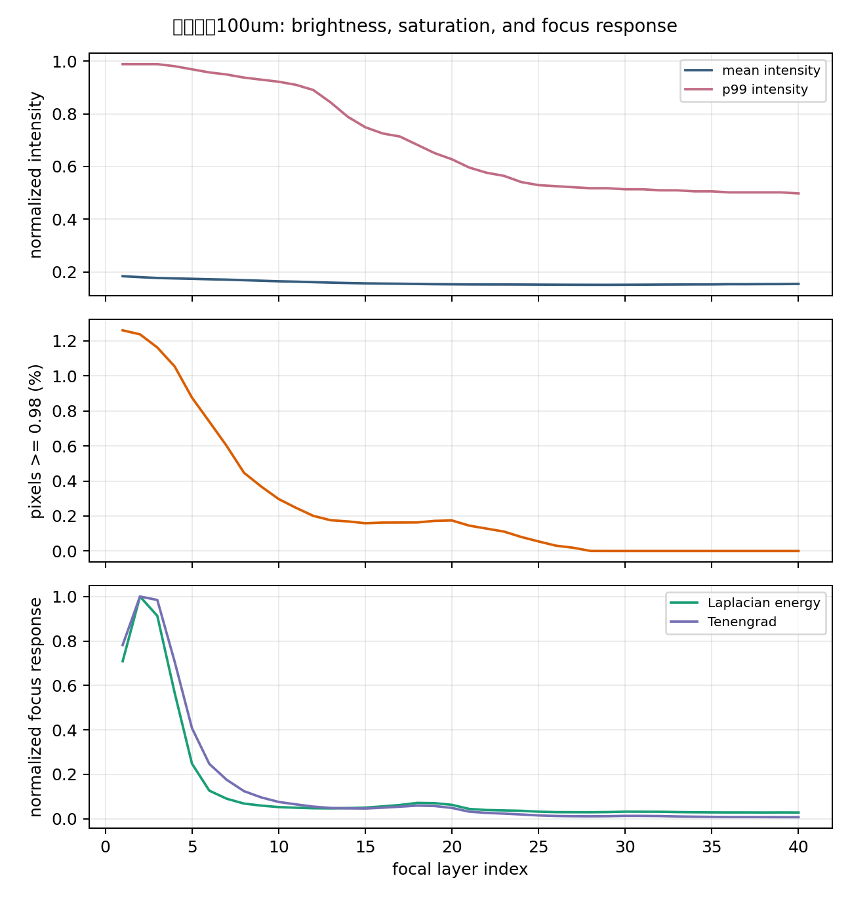
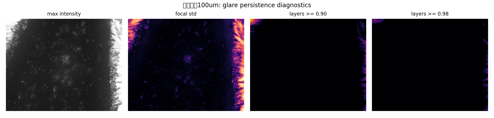
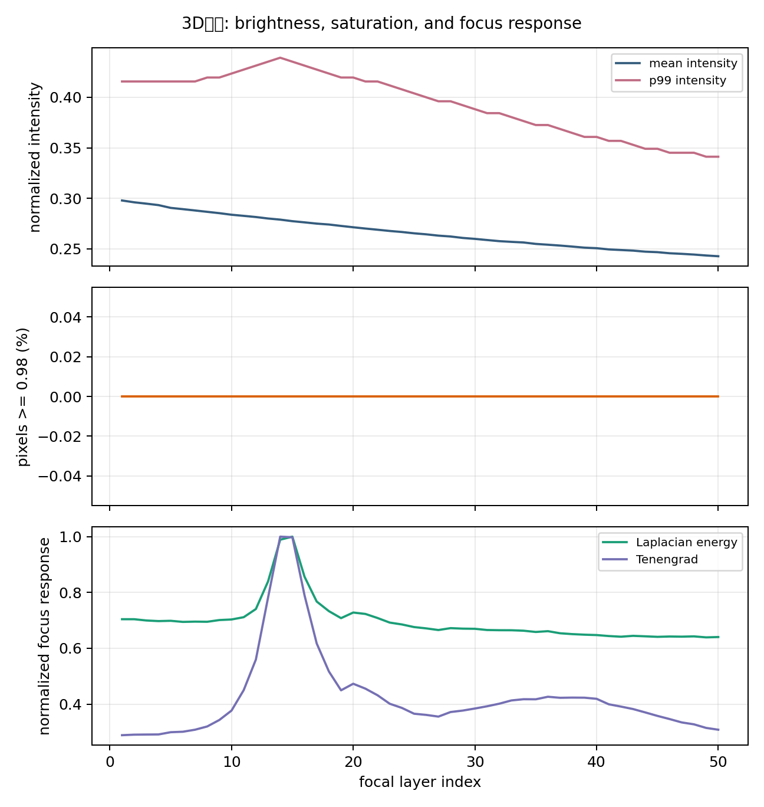

# 反光表面焦栈重建的光学机理广度优先分析报告

日期：2026-06-21  
项目：SRTP 反光工业表面缺陷焦栈三维重建  
建议主线：**Flare-Aware Focus-Stack Reconstruction for Reflective Surface Defect Morphology under Coaxial Microscopy**

## 1. 核心结论

当前最有投稿潜力的故事线应从“仿真到真实迁移”进一步收束为：**同轴显微成像下，反光微结构会在焦栈中产生高亮、近饱和、离焦伪边缘和异常焦点评价峰，从而破坏传统 DFF 的深度选择；本文通过物理可解释的眩光风险建模、仿真数据构造和先验引导网络，提升反光缺陷形貌重建的稳定性。**

这一主线比单纯讲 Simulation-to-Real 更强，原因有三点：

1. 真实痛点更具体：反光表面、微小缺陷、同轴照明、局部过曝和焦点评价失效。
2. 方法贡献更清晰：仿真不是最终目的，而是构造可控 ground truth 和反光先验的工具。
3. 实验设计更可辩护：合成数据报告绝对误差，真实样本报告无真值形貌稳定性和眩光区域行为。

## 2. 已有证据与观察

### 2.1 会议纪要中的问题定义

已整理的会议纪要指出，论文应避免把 Simulation-to-Real 放在最中心，应先解释反光表面为何让 DFF 失效。关键机理包括：

- 眩光来源于表面微结构、局部法线、同轴照明和成像孔径之间的耦合；
- 局部凹陷、刃脊、粗糙纹理可能形成类似微反射面的结构；
- 离焦条件下，高亮区域边缘仍会产生强梯度或高 Laplacian 响应；
- 传统 DFF 会把这些伪清晰边缘误判为最佳焦层，导致毛刺、尖峰和错误深度。

### 2.2 焦堆诊断统计

本轮对 `论文与PPT制作项目包/06_Samples/real_focus_stacks` 中 6 组真实焦堆做了轻量统计，输出文件为：

- `focus_stack_optical_probe_metrics.csv`
- `focus_stack_optical_probe_summary.md`
- `figures/` 下的 contact sheet、曲线图和高亮持久性图

关键统计如下：

| 样本 | 焦层数 | 最大近饱和比例 I>=0.98 | 任一焦层高亮比例 I>=0.90 | 半数以上焦层持续高亮比例 | Laplacian 最强焦层 | 解释 |
|---|---:|---:|---:|---:|---:|---|
| 3D表面 | 50 | 0.0000 | 0.0000 | 0.0000 | 15 | 低眩光对照，焦点评价峰更接近正常对焦响应 |
| 3D层纹 | 36 | 0.0000 | 0.0000 | 0.0000 | 17 | 低眩光对照，亮度动态范围较稳定 |
| 磕碰孔5um | 21 | 0.0000 | 0.0003 | 0.0000 | 9 | 存在极少量高亮像素，但未形成明显饱和区 |
| 钥匙尖头50um | 28 | 0.0000 | 0.0024 | 0.0000 | 13 | 有局部高亮，适合做中等眩光样本 |
| 钥匙纹路100um | 40 | 0.0126 | 0.0520 | 0.0016 | 2 | 最强反光证据，前几层近饱和且焦点评价峰集中 |
| 圆孔50um | 20 | 0.0000 | 0.0000 | 0.0000 | 7 | 低亮度缺陷样本，可作为形貌对照 |

### 2.3 代表性现象图

`钥匙纹路100um` 是当前最适合支撑眩光机制的样本。前几层 p99 intensity 接近 0.99，近饱和比例从约 1.26% 快速下降，Laplacian/Tenengrad 焦点评价峰也集中在前两层附近。这说明高亮区域可能主导局部清晰度评价，而非单纯反映真实几何焦点。



高亮持久性图显示，最亮区域集中在画面右侧边缘，并在多个焦层中持续出现。该现象支持把真实样本分成两类区域：部分焦层过曝但仍可能恢复的区域，以及多层持续近饱和、纹理信息高度缺失的不可恢复或低置信区域。



`3D表面` 可作为低眩光对照。该样本没有近饱和像素，亮度变化平缓，焦点评价峰更集中且与高亮区域解耦，说明正常焦堆中的 focus response 与反光样本中的高亮驱动响应具有明显差异。



### 2.4 已有模型结果对机理的支持

合成数据主表显示，Focus-ResUNet 的平均 MAE 为 53.22 um，优于 TinyDepthNet、Lee2013、Li2019、DFF+post、Original DFF 和 GADFF；在 edge MAE 上，Focus-ResUNet 平均 86.68 um，也明显优于传统方法。真实无真值指标显示，Focus-ResUNet 的平均 spike count 为 2.0，显著低于 Original DFF、DFF+post、Lee2013、Li2019 和 GADFF。

这些结果支持一个更稳健的表述：**学习型模型并非直接证明真实绝对高度准确，而是证明在可控合成真值上具有更低误差，并在真实样本上表现出更低尖峰、更平滑的相对形貌和更稳定的结构输出。**

## 3. 光学机理的广度优先假设

### H1：局部法线与接收孔径匹配导致镜面高亮

在同轴照明下，照明方向与观测方向接近重合。若局部微表面法线满足镜面反射方向进入物镜接收锥，则该位置会产生强高亮。可用下式定义眩光风险：

```text
r = 2(n · l)n - l
glare_risk(x) = 1[ arccos(r · v) <= theta_obj ]
theta_obj = arcsin(NA / n_medium)
```

其中 `n` 是局部表面法线，`l` 是入射方向，`v` 是观察方向，`theta_obj` 是物镜接收半角。空气中 NA=0.4 时，接收半角约为 23.6 度。这个模型能解释为什么平坦区域、斜坡、凹坑边缘和粗糙刃脊会有不同的眩光概率。

**可验证预测：**

- 高亮区域应与高曲率、强法线变化或边缘结构相关；
- 改变照明角、样品旋转角或物镜 NA 时，高亮区域应发生系统性变化；
- 仿真高度图的法线风险图应与真实焦堆中的 max-intensity / saturation-persistence map 有空间对应关系。

**优先级：高。** 这是最适合写入方法部分的物理先验。

### H2：离焦亮斑边缘制造伪清晰度峰

DFF 通常依赖梯度、Laplacian、Tenengrad 或局部方差等焦点评价。离焦高亮不是简单变暗，而可能在点扩散函数作用下扩大、扩散、形成亮斑边界。亮斑边界的梯度会被 focus measure 当成纹理细节。

```text
I_k(x) = clip( PSF(z - z_k) * R(x, n, l, v) + noise )
F_k(x) = Phi(I_k in local window)
```

当 `clip` 产生饱和平台，平台边缘的梯度和 Laplacian 可能增强，导致 `argmax_k F_k(x)` 偏向高亮焦层，而非真实高度焦层。

**可验证预测：**

- 高亮区域的最佳焦层会偏向 p99 intensity 或 saturation ratio 较高的层；
- 高亮区的 focus curve 可能单峰很尖，但该峰与真实形貌不一致；
- 对高亮区域做饱和掩膜后，传统 DFF 的峰值位置和置信度应明显改变。

**优先级：高。** 这直接连接“光学现象”和“DFF 失效”。

### H3：持续饱和与局部可恢复是两类不同问题

焦栈中某个像素若所有或多数焦层都近饱和，真实纹理信息已经被相机动态范围截断；若只在部分焦层近饱和，其他焦层仍可能保留可恢复信息。因此应区分：

```text
P_sat(x) = (1/K) sum_k 1[I_k(x) >= tau]
recoverable_glare: 0 < P_sat(x) < p_high
unrecoverable_glare: P_sat(x) close to 1
```

`钥匙纹路100um` 的高亮持久性图显示右侧边缘存在跨层高亮，但大部分画面没有多层持续近饱和。这说明真实样本更适合做分区分析，而不应只给全图平均指标。

**可验证预测：**

- `recoverable_glare` 区域中，加入焦向差分和饱和持久性 prior 应能改善结果；
- `unrecoverable_glare` 区域中，模型应输出低置信度或依赖邻域结构约束；
- 分区 MAE / edge MAE / spike count 比全图均值更能体现方法价值。

**优先级：高。** 这可以转化为实验表和消融表。

### H4：焦堆横向错位会放大边缘伪影

对焦过程中可能发生视场变化、机械漂移或样本微移。即使相位相关统计中多数样本 median shift 为 0 px，`磕碰孔5um` 的 max shift 约 2 px，仍需对局部边缘和高亮区域做更精细配准检查。反光区域的外观变化也可能干扰配准估计。

**可验证预测：**

- 真实焦堆中高梯度边缘的最优平移量可能不同于全图估计；
- 配准前后 DFF spike count、edge continuity 和 high-risk map 会变化；
- 若错位主要来自机械扫描，低亮纹理区域也会呈现一致方向偏移。

**优先级：中。** 需要作为数据质量检查，避免把采集误差误写成光学机理。

### H5：照明 NA 与成像 NA 不匹配会改变眩光分布

理想同轴照明常被简化为 `l ≈ v`，但实际 LED、分光器、镜筒、有限距离光源和照明孔径会让入射锥与成像接收锥不完全一致。若照明提前汇聚或发散，焦层扫描时局部亮度分布也会改变。

**可验证预测：**

- 不同 NA 或不同照明孔径下，高亮区域大小和位置会改变；
- 改变光源距离或光阑后，p99 intensity 曲线的下降速度会改变；
- 同一高度图在不同照明锥角仿真下会产生不同 glare-risk map。

**优先级：中高。** 这能把硬件设计和论文方法连接起来。

### H6：弱纹理与周期纹理造成 focus ambiguity

弱纹理区域缺少稳定梯度，周期纹理区域可能在多个焦层产生相似 focus response。此类问题与眩光不同，但会与眩光叠加，造成 DFF 置信度下降。

**可验证预测：**

- 低纹理区域 focus curve 平坦，峰值不显著；
- 周期纹理区域可能出现多峰；
- focal-difference volume 和邻域结构先验能减少多峰选择错误。

**优先级：中。** 它解释传统 DFF 的一般困难，但不是本文最独特的贡献点。

### H7：真实高度真值缺失限制了真实样本绝对结论

当前真实样本没有白光干涉仪、轮廓仪或共聚焦显微镜高度真值，因此真实样本只能支持相对形貌、尖峰抑制、动态范围和结构连续性结论。绝对高度精度必须来自合成数据或后续真实校准子集。

**可验证预测：**

- 若采集 step-height 或 WLI 子集，可以建立真实 absolute MAE；
- 无真值真实样本应避免出现“accuracy”类强表述；
- 投稿时必须把 synthetic quantitative evaluation 与 real no-reference validation 分开。

**优先级：高。** 这是论文 claim 边界。

## 4. 推荐论文故事线

### 4.1 暂定题目

**Flare-Aware Focus-Stack Reconstruction for Reflective Surface Defect Morphology under Coaxial Microscopy**

中文：**同轴显微成像下反光表面缺陷形貌的眩光感知焦栈重建方法**

### 4.2 一句话主张

This work studies how glare-prone reflective microstructures corrupt focus-stack depth-from-focus reconstruction under coaxial microscopy, and proposes a simulation-to-real, prior-guided reconstruction framework that uses flare-aware optical priors and synthetic ground truth to improve morphology stability on reflective defect surfaces.

### 4.3 四个贡献点

1. **Optical failure analysis.** 分析同轴照明、局部法线、成像接收孔径和离焦亮斑如何共同破坏传统 DFF。
2. **Simulation-based glare modeling.** 以微米级高度图、法线场、接收锥和焦向 PSF 构造可控焦堆与 glare-risk map。
3. **Prior-guided reconstruction.** 将 DFF/GADFF、focal-difference、saturation persistence 和 glare-risk prior 输入统一的 Focus-ResUNet 类模型，收束为一个最终方法。
4. **Two-level validation.** 在合成数据上报告 MAE / edge MAE / high-risk MAE，在真实数据上报告 no-reference morphology metrics 与高亮区域可视化。

## 5. 方法建议

### 5.1 最终模型收束

建议最终方法命名为：

**Flare-FocusNet** 或 **Flare-Aware Focus-ResUNet**

不建议在正文中并列展示 TinyDepthNet、Residual Focus-ResUNet 等多个产物。它们可进入 ablation 或 development history。主文只保留一个最终模型。

### 5.2 输入 prior 建议

| 输入通道 | 作用 | 与机理的关系 |
|---|---|---|
| 原始焦堆 | 保留真实强度和纹理信息 | 基础图像证据 |
| 相邻焦向差分 | 捕捉焦层变化和局部响应突变 | 对应 DFV / focal-volume 思路 |
| DFF 深度图 | 提供传统可解释几何估计 | 在可靠区域降低学习负担 |
| GADFF 或后处理 DFF | 提供另一种传统估计 | 作为互补 prior 或 baseline |
| saturation persistence map | 标注跨层高亮/近饱和区域 | 直接对应 H3 |
| focal std / max intensity map | 描述焦向亮度变化和高亮位置 | 支撑 flare-aware prior |
| focus confidence map | 描述 focus curve 是否尖锐或多峰 | 区分可靠与不可靠 DFF 区域 |

### 5.3 最小仿真模型

第一版仿真不必追求完整 Blender 物理真实，应优先实现可解释、可控、可消融：

1. 生成高度图：平面、V 谷、圆孔、刃脊、Perlin / fractal roughness。
2. 计算法线：`n = normalize([-dz/dx, -dz/dy, 1])`。
3. 建立同轴照明：`l ≈ v`，可加入有限照明锥角扰动。
4. 计算反射进入孔径风险：`arccos(r · v) <= theta_obj`。
5. 生成焦堆：用 depth-dependent PSF、亮度 clipping、噪声和纹理模拟焦层。
6. 输出标签：height map、glare-risk map、saturation mask、focus confidence map。

## 6. 实验方案

### 6.1 焦堆诊断实验

立即可执行：

- 对所有真实焦堆输出 p95/p99/mean intensity 曲线；
- 输出 saturation persistence map：`I>=0.90` 和 `I>=0.98`；
- 对高亮区域和非高亮区域分别计算 DFF focus curve；
- 检查高亮层是否与 Laplacian/Tenengrad 峰重合；
- 对代表性 ROI 输出逐层小图，展示亮斑扩散、边缘变化和焦向伪清晰。

### 6.2 合成数据分区评估

主表建议：

| Method | MAE | Edge MAE | High-Glare MAE | High-Risk MAE | Spike Count |
|---|---:|---:|---:|---:|---:|

消融表建议：

| Variant | DFF prior | Focal diff | Saturation prior | Glare-risk prior | Domain randomization | MAE | High-Risk MAE |
|---|---|---|---|---|---|---:|---:|

### 6.3 真实无真值评估

真实样本应报告：

- roughness stability；
- relative dynamic range；
- low-conf spike count；
- edge continuity / edge retention；
- high-glare ROI profile consistency；
- 高亮区域输出是否被标为低置信或被平滑成虚假尖峰。

### 6.4 真实真值补强

若投稿时间允许，建议增加一个小规模真实校准子集：

- step-height 标准样；
- 白光干涉仪 WLI；
- 共聚焦显微镜；
- 轮廓仪线扫。

只需 2-3 个代表性 ROI，就可以把真实样本论证从 qualitative/no-reference 提升到 partial quantitative validation。

## 7. 文献定位

### 7.1 Classical SFF/DFF

Nayar and Nakagawa 的 Shape from Focus 奠定了焦栈形状恢复基础；Pertuz et al. 系统比较了 focus measure operators；Lee2013 和 Li2019 代表自适应窗口与迭代增强路线。这组文献用于说明传统 DFF 的可解释性，以及窗口尺度、弱纹理、噪声和边缘区域的不稳定。

### 7.2 Learning-based Depth from Focus

DDFFNet 是早期端到端学习型 DFF；AiFDepthNet 用 all-in-focus supervision 缓解有无监督之间的差距；DFV 通过 differential focus volume 建模焦向一阶变化；Learning Depth from Focus in the Wild 强调真实相机焦堆的配准、弱纹理和仿真器；DDFS 显式引入相机参数和 defocus model 以增强 camera-setting invariance。

本项目应把 DFV 和 DDFS 作为最强相关工作：前者对应 focal-difference volume，后者对应光学参数与 synthetic-to-real gap。

### 7.3 Defocus / Simulation-to-Real

Focus on Defocus 使用 defocus cue 缓解 synthetic-to-real domain gap；DEReD 在没有 depth/AIF ground truth 时用 sparse focal stack 自监督；Dr.Bokeh 提供可微、遮挡感知的离焦渲染模型。这些工作支撑本文用物理成像模型、仿真和无真值真实样本进行训练/验证的逻辑。

### 7.4 Industrial Optical 3D Defect Reconstruction

2026 年 Applied Optics 的 Att-PU-Net 工作将 bright-field/dark-field structured illumination microscopy 与点云上采样网络结合，面向微纳尺度光学元件缺陷 3D 重建，并用 WLI 验证真实缺陷深度。这篇文献非常适合说明工业缺陷研究正在从 2D detection 转向 quantitative 3D morphology，也提示本文后续需要小规模真实真值校准。

### 7.5 Depth Foundation Models

Depth Anything 和 Depth Anything V2 说明大规模无标签数据、合成标签和 teacher-student pseudo-label 可以显著提升单目深度泛化。它们不适合作为本文主结果表中的直接 baseline，因为任务输入是单张 RGB，缺少焦栈轴向响应；但它们非常适合支撑“高质量合成真值 + 真实无标签样本 + 伪标签桥接”的训练策略讨论。

## 8. 投稿风险与应对

| 风险 | 可能审稿质疑 | 应对策略 |
|---|---|---|
| 真实样本无绝对高度真值 | 真实结果是否可信 | 明确 real no-reference boundary；增加 WLI/step-height 小子集 |
| 眩光机理只停留在猜测 | flare prior 是否物理合理 | 增加法线-孔径仿真、饱和持久性图、ROI focus curve |
| 外部 SOTA 偏旧 | 方法对比不足 | 优先补 DFV、DDFFNet；Related Work 更新 DDFS、DfF in Wild、DEReD、Depth Anything V2、Att-PU-Net |
| 模型产物过多 | 贡献不聚焦 | 正文只保留 Flare-FocusNet；其他模型进入 ablation |
| Simulation-to-Real 讲得泛 | 与通用深度估计重复 | 把 S2R 定位为反光焦堆缺少真实高度真值时的数据引擎 |

## 9. 建议的下一轮工作

1. 对 `钥匙纹路100um` 做 ROI 级逐层可视化，标注高亮边缘、饱和区域和 focus response 峰。
2. 实现微高度图法线-孔径 glare-risk simulator，先不追求复杂材质，只输出可解释风险图。
3. 将 saturation persistence、focal std、max intensity 和 focus confidence 整合为 flare-aware prior。
4. 在合成数据中按 glare-risk mask 分区报告 MAE。
5. 优先复现或适配 DFV；DDFFNet 作为第二优先级外部学习型 baseline。
6. 真实样本补拍时保留固定曝光、可选包围曝光，并记录物镜 NA、焦层间距、曝光时间和照明设置。

## 10. 参考文献与来源

- Nayar, S. K., and Nakagawa, Y. Shape from focus. IEEE TPAMI, 1994. https://doi.org/10.1109/34.308479
- Pertuz, S., Puig, D., and Garcia, M. A. Analysis of focus measure operators for shape-from-focus. Pattern Recognition, 2013. https://doi.org/10.1016/j.patcog.2012.11.011
- Lee, I. et al. Adaptive window selection for 3D shape recovery from image focus. Optics & Laser Technology, 2013. https://doi.org/10.1016/j.optlastec.2012.08.003
- Li, L. et al. Adaptive window iteration algorithm for enhancing 3D shape recovery from image focus. Chinese Optics Letters, 2019. https://doi.org/10.3788/COL201917.061001
- Hazirbas, C. et al. Deep Depth From Focus. ACCV, 2018/2019. https://arxiv.org/abs/1704.01085
- Wang, N.-H. et al. Bridging Unsupervised and Supervised Depth from Focus via All-in-Focus Supervision. ICCV, 2021. https://arxiv.org/abs/2108.10843
- Yang, F. et al. Deep Depth from Focus with Differential Focus Volume. CVPR, 2022. https://arxiv.org/abs/2112.01712
- Won, C., and Jeon, H.-G. Learning Depth from Focus in the Wild. ECCV, 2022. https://arxiv.org/abs/2207.09658
- Fujimura, Y. et al. Deep Depth from Focal Stack with Defocus Model for Camera-Setting Invariance. IJCV, 2024. https://arxiv.org/abs/2202.13055
- Maximov, M. et al. Focus on Defocus: Bridging the Synthetic to Real Domain Gap for Depth Estimation. CVPR, 2020. https://arxiv.org/abs/2005.09623
- Si, H. et al. Fully Self-Supervised Depth Estimation from Defocus Clue. CVPR, 2023. https://arxiv.org/abs/2303.10752
- Sheng, Y. et al. Dr.Bokeh: DiffeRentiable Occlusion-Aware Bokeh Rendering. CVPR, 2024. https://arxiv.org/abs/2308.08843
- Yang, L. et al. Depth Anything: Unleashing the Power of Large-Scale Unlabeled Data. CVPR, 2024. https://arxiv.org/abs/2401.10891
- Yang, L. et al. Depth Anything V2. 2024. https://arxiv.org/abs/2406.09414
- Nikon MicroscopyU. Numerical Aperture. https://www.microscopyu.com/microscopy-basics/numerical-aperture
- Wang, Z. et al. Defect 3D reconstruction with integrated bright-field and dark-field structured illumination microscopy based on Att-PU-Net. Applied Optics, 2026. https://doi.org/10.1364/AO.587592
