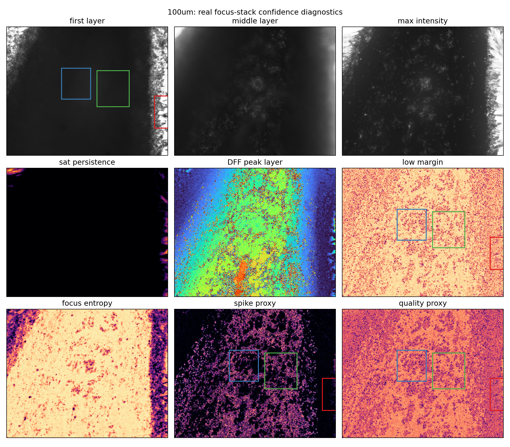
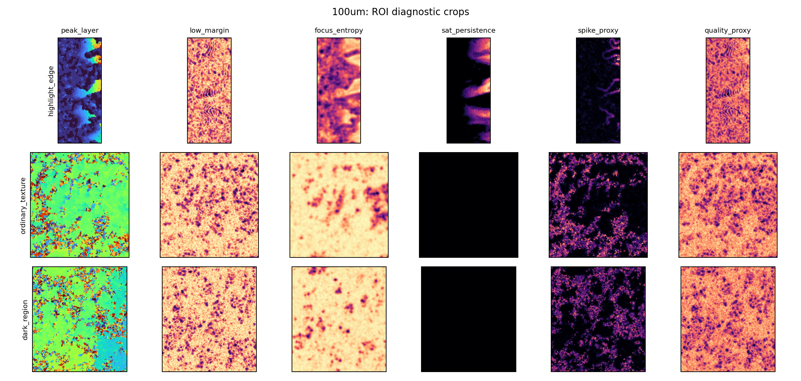

# 真实焦栈 Focus Confidence 诊断报告

日期：2026-06-22  
真实样本：`论文与PPT制作项目包/06_Samples/real_focus_stacks/钥匙纹路100um/`  
结果目录：`submission_planning/optical_mechanism_analysis/real_confidence_probe/`  
脚本：`submission_planning/tools/real_focus_stack_confidence_probe.py`

## 1. 研究问题

前两轮 synthetic 实验显示，DFF failure 更直接地对应 focus-response 置信度结构，尤其是 top-2 focus margin，而几何 glare risk 更适合作为物理解释先验。真实样本缺少逐像素高度真值，因此本轮不评估 absolute MAE，而是检查真实焦栈内部是否存在与该机制一致的无参考证据：

- 高亮/过曝区域是否对应早层 focus peak；
- `low_margin`、`focus_entropy`、`low_peak_strength` 是否能定位 DFF peak layer 局部跳变；
- saturation persistence 与 focus confidence 是否对应不同类型的不可靠性。

这一步的目的不是证明模型误差下降，而是把 synthetic confidence prior 与真实焦栈现象连接起来，为论文中的 no-reference diagnostic 和 limitation 提供依据。

## 2. 方法

脚本读取 40 层真实焦栈，并统一缩放到 512 x 640。使用 Laplacian focus measure 构造 DFF focus volume，并计算以下无参考图：

| Map | 含义 |
|---|---|
| `peak_layer` | 每个像素 DFF 选择的最佳焦层 |
| `low_margin` | top-1 与 top-2 focus response 接近程度 |
| `focus_entropy` | focus response 在焦向上的分散程度 |
| `low_peak_strength` | 最大 focus response 较弱的位置 |
| `sat_persistence` | 焦栈中 `I >= 0.98` 的层数比例 |
| `bright_persistence` | 焦栈中 `I >= 0.90` 的层数比例 |
| `spike_proxy` | peak layer 与局部邻域均值的偏离程度 |
| `quality_proxy` | `low_margin`、`spike_proxy`、`sat_persistence` 的组合无参考质量图 |

其中 `spike_proxy` 是 DFF 层选择局部不稳定性的 proxy；`sat_persistence` 是强高亮/过曝的 proxy。二者都不是 ground-truth error，只能作为无参考诊断。

## 3. ROI 结果

| ROI | peak layer mean | low margin mean | focus entropy mean | sat persistence mean | spike proxy mean | quality proxy mean |
|---|---:|---:|---:|---:|---:|---:|
| `highlight_edge` | 3.03 | 0.7910 | 0.8454 | 0.0364 | 0.0204 | 0.5877 |
| `ordinary_texture` | 18.88 | 0.8395 | 0.9757 | 0.0000 | 0.1174 | 0.6451 |
| `dark_region` | 18.49 | 0.8442 | 0.9794 | 0.0000 | 0.1223 | 0.6506 |





## 4. Proxy association 结果

| Score | Spearman with spike proxy | AUC spike top10 | AUC saturation top10 | AUC early-peak top10 |
|---|---:|---:|---:|---:|
| `low_margin` | 0.4710 | 0.7293 | 0.5002 | 0.4420 |
| `focus_entropy` | 0.6136 | 0.7804 | 0.4091 | 0.2048 |
| `low_peak_strength` | 0.7085 | 0.8491 | 0.4649 | 0.2090 |
| `sat_persistence` | 0.1251 | 0.5384 | 1.0000 | 0.6728 |
| `bright_persistence` | 0.0738 | 0.5172 | 0.9780 | 0.6792 |
| `quality_proxy` | 0.6522 | 0.9289 | 0.5182 | 0.4367 |

## 5. 关键解释

### 5.1 真实样本中存在两类不可靠性

第一类是**早层高亮/过曝型不可靠性**。`highlight_edge` ROI 的 mean peak layer 为 3.03，sat persistence mean 为 0.0364，而 ordinary/dark ROI 的 sat persistence 为 0。这说明样本右侧高亮边缘区域确实在早期焦层表现出强亮度和局部饱和。`sat_persistence` 对 saturation top10 的 AUC 为 1.0000，`bright_persistence` 为 0.9780，说明亮度持久性可以非常直接地定位这类区域。

第二类是**DFF 层选择局部跳变型不可靠性**。ordinary/dark ROI 的 spike proxy mean 分别为 0.1174 和 0.1223，高于 highlight ROI 的 0.0204。这说明真实焦栈中的 DFF peak layer 在低亮度区域也存在局部散点和跳变，不完全由饱和高亮决定。`low_margin` 对 spike top10 的 AUC 为 0.7293，`focus_entropy` 为 0.7804，`low_peak_strength` 为 0.8491，组合 `quality_proxy` 达到 0.9289。

### 5.2 Synthetic 结论在真实样本上得到部分支持

真实样本没有 GT，因此不能直接验证 `low_margin` 是否对应 absolute height error。但它与 `spike_proxy` 的 Spearman 相关为 0.4710，AUC spike top10 为 0.7293，说明它能在真实焦栈中识别 DFF 层选择局部不稳定区域。这与 synthetic 稳健性实验中 “top-2 margin 是稳定 failure indicator” 的方向一致。

同时，真实样本也提醒我们：`low_margin` 不是唯一诊断。`low_peak_strength` 和 `focus_entropy` 对 spike proxy 的关联更强，而 `sat_persistence/bright_persistence` 对高亮区域更直接。因此，真实样本中的 quality map 应分成两层：

```text
focus instability: low_margin / focus_entropy / low_peak_strength
glare saturation:  sat_persistence / bright_persistence
```

这比单一 `glare risk` 或单一 `low_margin` 更符合真实焦栈现象。

### 5.3 对论文方法的影响

论文中的 no-reference quality prior 可以写成：

```text
Q_real(x) = alpha * (1 - M_focus(x))
          + beta  * H_focus(x)
          + gamma * (1 - S_peak(x))
          + eta   * P_sat(x)
```

其中前三项描述 focus-response instability，`P_sat` 描述 glare/saturation persistence。训练时在 synthetic 数据上可以用 GT error 校准权重；真实样本上则把它作为可视化诊断和质量解释，不作为误差真值。

## 6. 局限

本轮真实样本分析没有绝对高度真值，也没有严格配准验证，因此所有结果都只能解释为 no-reference proxy。`spike_proxy` 代表 DFF peak layer 的局部不连续，不等于真实高度误差；`sat_persistence` 代表强亮度异常，也不一定意味着不可恢复。后续应结合真实 GT 或至少人工 ROI 标注，进一步验证这些 proxy 与重建误差之间的关系。

## 7. 可直接写入论文的表述

### 中文

在真实 `钥匙纹路100um` 焦栈上，我们进一步计算无参考质量图，以检查 synthetic confidence prior 是否对应真实焦栈中的不稳定现象。结果显示，右侧高亮边缘 ROI 的平均 DFF peak layer 为 3.03，且存在非零 saturation persistence，而普通纹理和暗区 ROI 的 peak layer 主要位于第 18-19 层且无持续饱和。另一方面，DFF peak layer 的局部跳变更多出现在普通/暗区，其 spike proxy 与 `low_margin`、`focus_entropy`、`low_peak_strength` 均呈正相关，其中 `low_margin` 对 spike top10 的 AUC 为 0.7293，组合 `quality_proxy` 达到 0.9289。这说明真实焦栈中至少存在两类不可靠性：由过曝/高亮驱动的早层异常，以及由 focus response 不稳定驱动的局部层选择跳变。由于缺少真实高度真值，这些结果应作为无参考诊断证据，而非绝对误差评估。

### English

On the real focus stack of the 100um key-texture sample, we compute no-reference quality maps to examine whether the synthetic confidence prior corresponds to real focus-stack instability. The highlight-edge ROI has a mean DFF peak layer of 3.03 and non-zero saturation persistence, whereas the ordinary-texture and dark-region ROIs mainly peak around layers 18-19 with no persistent saturation. In contrast, local peak-layer discontinuities are more pronounced in the ordinary and dark regions. The spike proxy is positively associated with low margin, focus entropy, and low peak strength; the low-margin score achieves an AUC of 0.7293 for identifying the top 10% spike-proxy pixels, while the combined quality proxy reaches 0.9289. These observations suggest two different types of unreliable regions in real stacks: early-layer glare/saturation artifacts and focus-response instability. Since real height ground truth is unavailable, these results are used as no-reference diagnostic evidence rather than absolute error measurements.
