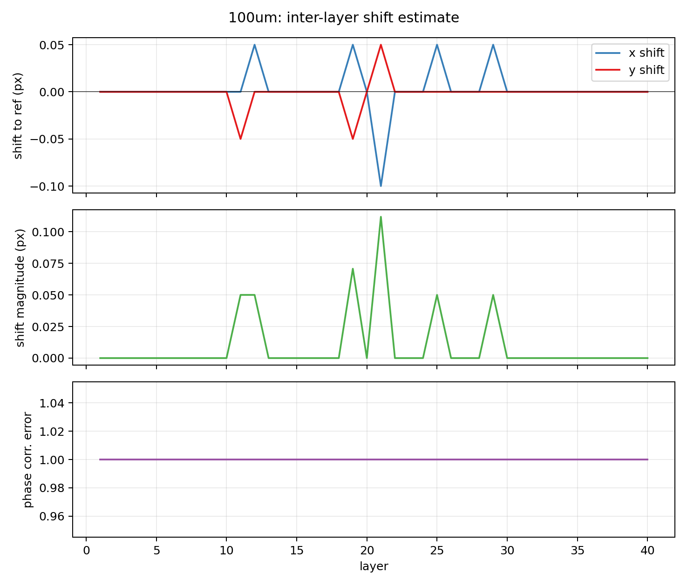
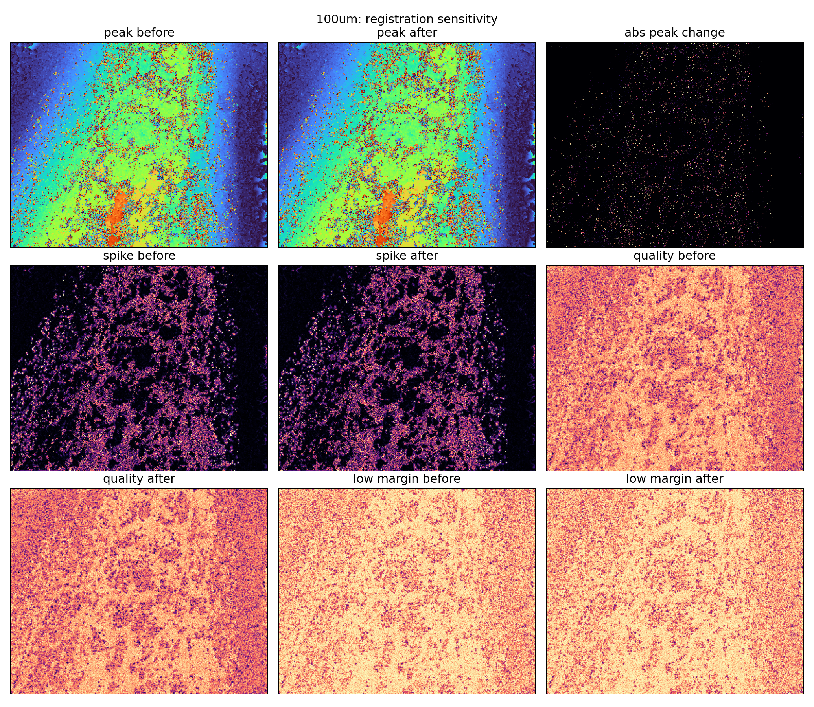

# 真实焦栈层间配准敏感性报告

日期：2026-06-22  
真实样本：`论文与PPT制作项目包/06_Samples/real_focus_stacks/钥匙纹路100um/`  
结果目录：`submission_planning/optical_mechanism_analysis/real_registration_probe/`  
脚本：`submission_planning/tools/real_focus_stack_registration_probe.py`

## 1. 研究问题

上一轮真实焦栈分析发现，`钥匙纹路100um` 中存在两类无参考不可靠性：右侧高亮边缘对应早层饱和，普通/暗区存在 DFF peak layer 的局部跳变。一个必须排除的替代解释是：这些现象可能主要来自焦栈采集过程中的层间平移或视野漂移。

本轮实验检查：

- 真实焦栈不同层之间是否存在显著全局平移；
- 对焦栈做全局平移配准后，DFF peak layer、spike proxy 和 quality proxy 是否发生本质改变；
- `low_margin` 与 spike proxy 的关联是否依赖未配准图像。

这一步只检查**全局平移敏感性**，不等价于完整光学标定，也不能排除非刚性形变、放大率变化、照明角变化或入瞳变化。

## 2. 方法

读取 40 层真实焦栈并缩放到 512 x 640。使用第 20 层作为参考层，在裁掉两侧高亮边缘后的中心区域上做 phase cross-correlation，估计每层相对参考层的亚像素平移。随后对每层图像做相应平移校正，再分别计算配准前后的：

- DFF peak layer；
- spike proxy；
- low margin；
- focus entropy；
- saturation persistence；
- quality proxy；
- 各 score 对 spike proxy top10 的 AUC。

相位相关返回的 `registration_error` 在该强离焦焦栈中不稳定，本报告不把它作为质量指标，只使用估计位移量与配准前后诊断图变化作为判断依据。

## 3. 层间位移结果

| 指标 | 数值 |
|---|---:|
| Max shift magnitude | 0.1118 px |
| Median shift magnitude | 0.0000 px |
| X shift range | -0.1000 to 0.0500 px |
| Y shift range | -0.0500 to 0.0500 px |

结果显示，在当前中心区域配准设置下，估计到的全局平移极小，最大位移约 0.11 px，中位数为 0。这说明样本的主要 DFF 不稳定现象很难由整幅图像级别的层间平移单独解释。

## 4. 配准前后敏感性结果

| Metric | Value |
|---|---:|
| `peak_layer_changed_fraction` | 0.0468 |
| `peak_layer_mean_abs_change` | 0.3875 |
| `peak_layer_p90_abs_change` | 0.0000 |
| `spike_proxy_mean_before` | 0.0995 |
| `spike_proxy_mean_after` | 0.1041 |
| `spike_proxy_pearson_before_after` | 0.9478 |
| `quality_proxy_mean_before` | 0.6375 |
| `quality_proxy_mean_after` | 0.5976 |
| `quality_proxy_pearson_before_after` | 0.9825 |
| `low_margin_auc_spike_top10_before` | 0.7293 |
| `low_margin_auc_spike_top10_after` | 0.7287 |
| `quality_proxy_auc_spike_top10_before` | 0.9289 |
| `quality_proxy_auc_spike_top10_after` | 0.9299 |
| `sat_persistence_auc_spike_top10_before` | 0.5384 |
| `sat_persistence_auc_spike_top10_after` | 0.5398 |

## 5. 关键解释

### 5.1 全局平移不是主要解释

配准估计的最大位移只有 0.1118 px，且大部分层位移为 0。配准后，只有 4.68% 像素的 DFF peak layer 发生变化，90% 像素的 peak layer 变化为 0。说明当前真实焦栈中的大面积 peak layer 结构和主要散点分布在全局平移校正后仍然保留。

### 5.2 Confidence / spike 关系对配准不敏感

配准前后 spike proxy 的 Pearson 相关为 0.9478，quality proxy 的 Pearson 相关为 0.9825。更关键的是，`low_margin` 对 spike top10 的 AUC 从 0.7293 变为 0.7287，几乎不变；组合 `quality_proxy` 对 spike top10 的 AUC 从 0.9289 变为 0.9299。

这说明上一轮“focus confidence 能定位真实焦栈中 DFF 层选择局部不稳定区域”的结论，对小幅全局平移配准不敏感。

### 5.3 Saturation persistence 的角色保持独立

`sat_persistence` 对 spike top10 的 AUC 配准前为 0.5384，配准后为 0.5398，仍接近随机。这与上一轮结论一致：高亮/过曝持久性主要定位右侧早层强亮区域，spike proxy 则更多描述局部层选择不连续。二者应作为两类不同无参考诊断，而不宜合并成单一错误标签。

## 6. 对论文论证的影响

本轮结果补上了真实样本分析中的一个关键防御点：

> In the real 100um key-texture focus stack, the estimated global inter-layer translation is below 0.12 pixels. After translation compensation, the focus-confidence and spike-proxy maps remain highly correlated with their original versions, and the low-margin score keeps nearly the same AUC for identifying spike-proxy regions. Therefore, the observed focus-stack instability cannot be explained by small global frame shifts alone.

论文中可以把这部分放在 Discussion 或 Real-sample diagnostic 小节，用来说明真实焦栈中的 DFF 不稳定至少有一部分来自焦向响应、反光/高亮和弱纹理结构，而不只是由简单拍摄漂移造成。

## 7. 局限

本轮只估计二维全局平移，且使用中心区域做相位相关。它不能排除以下因素：

- 层间放大率变化；
- 非刚性局部形变；
- 主光线方向变化；
- 入瞳或照明锥角变化；
- 由于离焦导致的结构外观变化。

因此，本结果应作为“全局平移不足以解释现象”的证据，而不应写成“已完全排除所有采集几何误差”。

## 8. 可直接写入论文的表述

### 中文

为排除层间全局位移对真实焦栈诊断结果的影响，我们以第 20 层为参考，在中心区域使用相位相关估计各焦层的平移量。结果显示，最大位移仅为 0.1118 像素，中位数为 0。对焦栈进行平移补偿后，DFF peak layer 发生变化的像素比例为 4.68%，spike proxy 与补偿前的 Pearson 相关为 0.9478，quality proxy 的相关为 0.9825。`low_margin` 对 spike top10 的 AUC 从 0.7293 变为 0.7287，几乎保持不变。这说明真实焦栈中观察到的 focus-response 不稳定和 DFF 局部层选择跳变，不能仅由小幅全局平移解释。

### English

To evaluate whether the real-stack diagnostics are dominated by inter-layer translation, we estimate global shifts using phase cross-correlation with layer 20 as the reference. The maximum estimated shift magnitude is only 0.1118 pixels, with a median of 0 pixels. After translation compensation, only 4.68% of pixels change their selected DFF peak layer. The spike-proxy map remains highly correlated with the original map (Pearson = 0.9478), and the quality-proxy map is even more stable (Pearson = 0.9825). The AUC of the low-margin score for identifying top 10% spike-proxy pixels changes from 0.7293 to 0.7287. These results indicate that the observed focus-response instability and local DFF layer-selection jumps cannot be explained by small global frame shifts alone.
