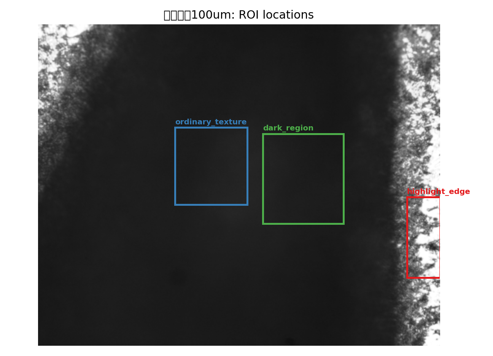
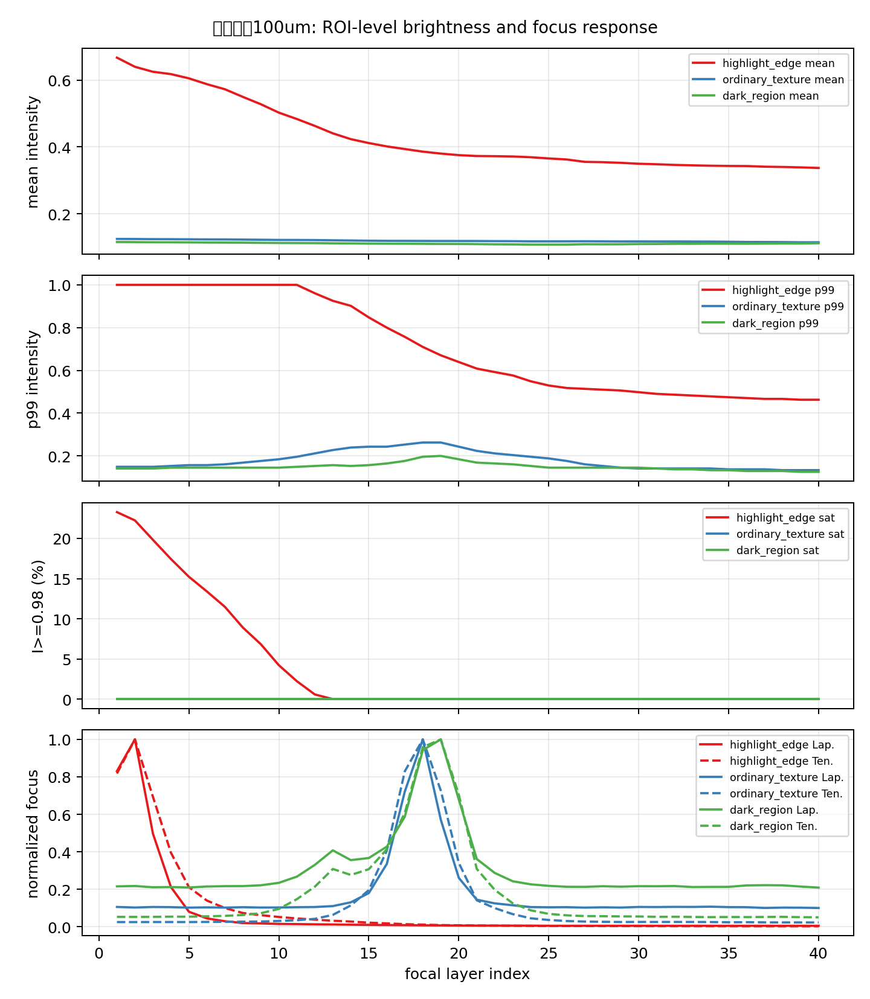
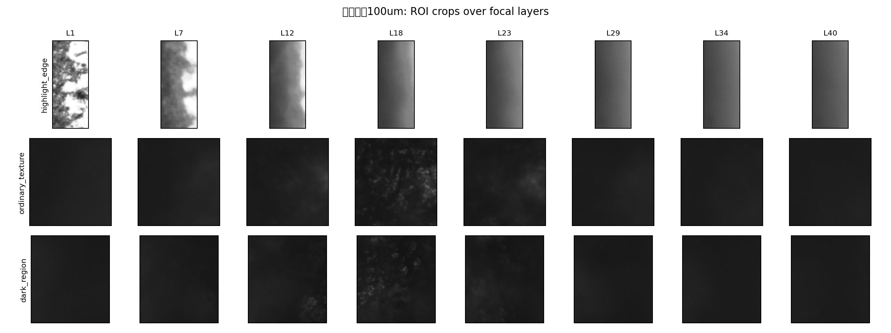

# ROI 局部证据与光学文献补充报告

日期：2026-06-21  
位置：`submission_planning/optical_mechanism_analysis/`

## 1. 新增结论

本轮 ROI 级分析进一步强化了主报告中的核心判断：**反光区域的焦向响应与普通纹理区域明显不同，高亮边缘 ROI 的近饱和层与 Laplacian/Tenengrad 峰值层重合，而普通纹理和暗区的焦点评价峰出现在更靠后的焦层。** 这说明同一真实焦堆内部同时存在两套响应机制：一类由反光/近饱和边缘主导，一类由正常纹理清晰度主导。

该结论可以作为投稿故事中 Figure 1 或 failure analysis 图的关键证据。

## 2. ROI 级焦堆证据

### 2.1 样本与 ROI

样本：`论文与PPT制作项目包/06_Samples/real_focus_stacks/钥匙纹路100um`  
焦层数：40  
分析输出：

- `roi_probe/钥匙纹路100um_roi_summary.md`
- `roi_probe/钥匙纹路100um_roi_metrics.csv`
- `roi_probe/钥匙纹路100um_roi_locations.png`
- `roi_probe/钥匙纹路100um_roi_curves.png`
- `roi_probe/钥匙纹路100um_roi_montage.png`

ROI 分成三类：

| ROI | 含义 | 选择方式 |
|---|---|---|
| `highlight_edge` | 高亮边缘/反光风险区 | 在全焦堆 `max intensity + focal std` 最高区域附近自动选取 |
| `ordinary_texture` | 普通纹理区 | 选取远离高亮边缘、有正常焦向纹理变化的区域 |
| `dark_region` | 暗区/低亮区域 | 选取平均亮度较低、无明显过曝区域 |

### 2.2 关键统计

| ROI | max p99 | 最大近饱和比例 I>=0.98 | Laplacian 最强层 | Tenengrad 最强层 | 解释 |
|---|---:|---:|---:|---:|---|
| highlight_edge | 1.0000 | 0.2328 | 2 | 2 | 高亮层与焦点评价峰重合，存在强烈 glare-driven focus response |
| ordinary_texture | 0.2627 | 0.0000 | 18 | 18 | 无近饱和，焦点评价峰来自正常纹理清晰度 |
| dark_region | 0.2000 | 0.0000 | 19 | 19 | 无近饱和，焦点评价峰与普通纹理区接近 |

局部证据比全图统计更强。全图中 `钥匙纹路100um` 的最大近饱和比例约为 1.26%，但高亮边缘 ROI 中最大近饱和比例达到约 23.28%。这说明眩光问题具有强局部性，全图均值会稀释真实失效机制。







### 2.3 对 DFF 失效机制的解释

在 `highlight_edge` ROI 中，前几层的 p99 intensity 等于 1.0，且第 1 层近饱和比例约 23.28%，第 2 层约 22.24%。Laplacian 和 Tenengrad 的峰值都出现在第 2 层。该现象说明，高亮边缘在离焦或半离焦状态下仍能产生强梯度与强局部能量，从而可能被 DFF 误判为最佳焦层。

在 `ordinary_texture` 和 `dark_region` 中，没有近饱和像素，Laplacian/Tenengrad 峰值分别出现在第 18/19 层。普通区域的焦向曲线更符合“纹理在真实焦平面附近最清晰”的 DFF 假设。

因此，本文可以提出一个更具体的失效链条：

```text
reflective microstructure
-> local specular highlight / near saturation
-> defocused highlight boundary remains high-gradient
-> focus measure peak shifts to glare-dominated layers
-> DFF selects wrong depth
-> depth spikes / false ridges / morphology distortion
```

## 3. 光学机理补充：从 NA、BRDF 到焦栈

### 3.1 物镜 NA 与接收锥

显微物镜的 numerical aperture 可写为：

```text
NA = n sin(theta)
```

其中 `n` 是介质折射率，`theta` 是物镜能接收或发射的光锥半角。对空气中 NA=0.4 的物镜，`theta = arcsin(0.4) ≈ 23.6°`。这给 glare-risk model 提供了一个可解释阈值：如果局部镜面反射方向落入该接收锥，就有较高概率进入相机并形成高亮。

对应本文方法，可将局部高度图 `z(x,y)` 转换为法线：

```text
n = normalize([-dz/dx, -dz/dy, 1])
```

再由入射方向 `l`、观察方向 `v` 和法线 `n` 计算反射方向：

```text
r = 2(n·l)n - l
glare_risk = 1[ arccos(r·v) <= arcsin(NA/n_medium) ]
```

这一路径能把“眩光”从主观图像现象转化为可仿真、可消融的物理先验。

### 3.2 Microfacet / BRDF 对反光表面的意义

Cook-Torrance 类 microfacet 模型把粗糙表面看作许多微小镜面片的统计集合。对本文而言，完整 BRDF 拟合并非首要目标，但 microfacet 思想非常重要：反光并不只来自宏观平面，粗糙刃脊、孔边缘、微凹陷和加工纹理中的局部法线也可能把光反射进成像孔径。

因此，本文的仿真可以从“最小 microfacet 解释”开始：

- 高度图提供局部斜率和法线；
- 粗糙度控制法线分布；
- 同轴照明设定入射方向分布；
- NA 接收锥判断哪些法线更容易形成高亮；
- defocus PSF 与 clipping 解释高亮如何污染 focus measure。

这比直接用黑箱神经网络解释反光失效更适合投稿给光学/成像相关方向。

### 3.3 Focus variation 表面计量的相关性

工业三维表面计量中，focus variation 本身就是常见路线。相关文献通常强调多焦图像、表面粗糙度、局部反射、陡峭边缘和低反射区域对测量稳定性的影响。本文与 focus variation 的联系在于：都利用焦向扫描恢复表面形貌，但本文对象更集中于反光工业缺陷焦堆，并引入 simulation-based ground truth 与深度网络校正。

可写入 Related Work 的定位：

> Focus variation microscopy has been widely used for optical surface metrology, but reflective micro-defects under coaxial illumination remain challenging because local reflectance and defocus artifacts can alter the focus response. Our work focuses on this failure mode and introduces glare-aware simulation and prior-guided reconstruction for reflective defect morphology.

## 4. 可直接写进论文的机制段落

### 中文段落

在同轴显微成像中，反光缺陷表面的局部法线会改变入射光进入物镜接收锥的概率。当局部微表面满足镜面反射方向与观察方向近似一致时，焦堆中会出现局部高亮甚至近饱和区域。与普通纹理不同，这些高亮区域在离焦状态下仍可能通过亮斑边缘产生较强梯度或 Laplacian 响应，使传统 DFF 的焦点评价峰偏向反光层。我们的真实焦堆 ROI 分析显示，在 `钥匙纹路100um` 样本中，高亮边缘区域的近饱和比例最高达到约 23.28%，其 Laplacian 和 Tenengrad 峰值均位于第 2 焦层；普通纹理和暗区没有近饱和像素，焦点评价峰分别位于第 18/19 焦层。这表明反光区域的 focus response 与正常纹理区域存在明显机制差异，需要显式建模 glare-risk 和 saturation persistence。

### English paragraph

Under coaxial microscopy, the local normals of reflective defect surfaces determine whether specularly reflected light falls within the acceptance cone of the objective. When the reflection direction is close to the viewing direction, the focal stack may contain localized highlights or near-saturated regions. Unlike ordinary texture, such highlights can still produce strong gradients or Laplacian responses through defocused highlight boundaries, causing conventional DFF focus measures to peak at glare-dominated layers. In our real focal-stack ROI analysis of the `key texture 100um` sample, the highlight-edge ROI reaches a near-saturation ratio of 23.28%, and both Laplacian and Tenengrad responses peak at focal layer 2. In contrast, ordinary-texture and dark-region ROIs contain no near-saturated pixels and peak at layers 18/19. This suggests that reflective regions and normal texture regions follow different focus-response mechanisms, motivating explicit glare-risk and saturation-persistence modeling.

## 5. 进一步实验建议

| 目的 | 最小实验 | 可交付结果 |
|---|---|---|
| 证明高亮区域主导 DFF 错误 | 在 `highlight_edge` ROI 上运行传统 DFF focus curve 与预测深度对照 | ROI focus curve + depth selection figure |
| 证明反光机制与法线相关 | 用简单高度图生成 normal map 和 glare-risk map | height/normal/risk 三联图 |
| 证明 saturation prior 有用 | 加入 `P_sat(x)` 或 `max_intensity(x)` 通道做消融 | high-risk MAE 和 spike count 表 |
| 排除机械漂移 | ROI 局部配准与全图配准对照 | shift curve + before/after focus curve |
| 连接真实真值 | 用 WLI/共聚焦/标准台阶测 1-2 个 ROI | 真实局部 absolute error |

## 6. 补充文献矩阵

| 主题 | 代表来源 | 对本文的价值 | 写法 |
|---|---|---|---|
| Numerical aperture | Nikon MicroscopyU numerical aperture | 支持 `NA = n sin(theta)` 与接收锥解释 | Method 中定义 glare-risk 阈值 |
| Microfacet reflection | Cook-Torrance reflectance model; Torrance-Sparrow rough surface reflection | 支持“粗糙微表面局部法线导致镜面反射” | Related Work / Method motivation |
| Focus variation metrology | Optical focus-variation surface metrology literature | 说明焦向扫描本身是工业表面计量路线 | Introduction / Related Work |
| DFF/SFF | Nayar1994; Pertuz2013; Lee2013; Li2019 | 建立传统焦点评价背景 | Background / Baselines |
| Learning DFF | DDFFNet; DFV; DDFS; DfF in the Wild | 建立最新焦堆学习型对比 | Experiments / Related Work |
| Defocus S2R | Focus on Defocus; DEReD; Dr.Bokeh | 支持仿真、可微成像和无真值学习 | Discussion |
| Industrial 3D defect | Att-PU-Net BDSIM 2026 | 说明光学缺陷研究正在走向 3D 形貌与 WLI 验证 | Related Work / Future validation |

## 7. 参考链接

- Nikon MicroscopyU Numerical Aperture: https://www.microscopyu.com/microscopy-basics/numerical-aperture
- Cook and Torrance, A Reflectance Model for Computer Graphics: https://doi.org/10.1145/357290.357293
- Nayar and Nakagawa, Shape from Focus: https://doi.org/10.1109/34.308479
- Pertuz et al., Analysis of focus measure operators for shape-from-focus: https://doi.org/10.1016/j.patcog.2012.11.011
- Yang et al., Deep Depth from Focus with Differential Focus Volume: https://arxiv.org/abs/2112.01712
- Fujimura et al., Deep Depth from Focal Stack with Defocus Model for Camera-Setting Invariance: https://arxiv.org/abs/2202.13055
- Won and Jeon, Learning Depth from Focus in the Wild: https://arxiv.org/abs/2207.09658
- Maximov et al., Focus on Defocus: https://arxiv.org/abs/2005.09623
- Si et al., Fully Self-Supervised Depth Estimation from Defocus Clue: https://arxiv.org/abs/2303.10752
- Sheng et al., Dr.Bokeh: https://arxiv.org/abs/2308.08843
- Yang et al., Depth Anything V2: https://arxiv.org/abs/2406.09414
- Wang et al., Att-PU-Net BDSIM defect 3D reconstruction: https://doi.org/10.1364/AO.587592
