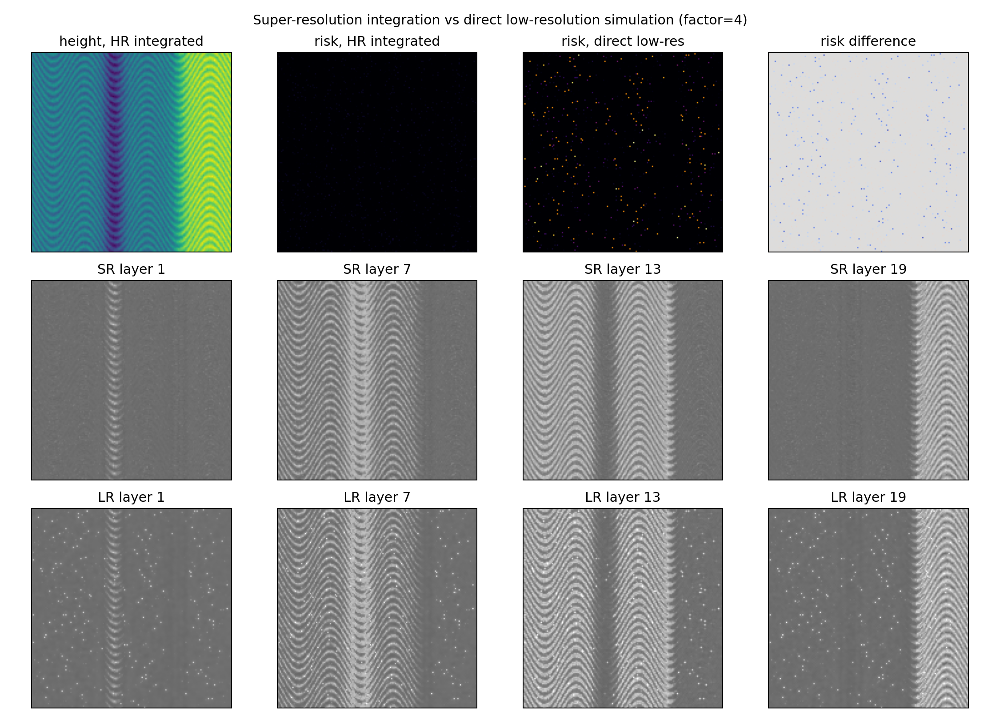
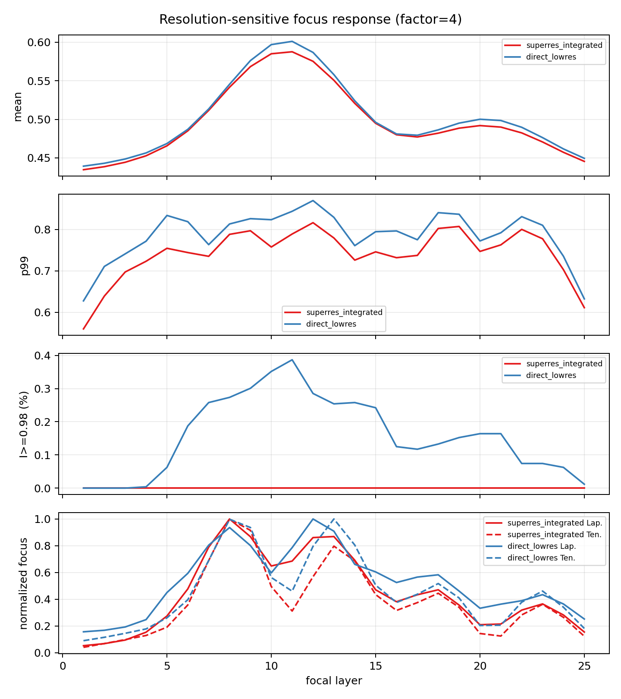

# 超分辨下采样仿真分支报告

日期：2026-06-21  
分支目录：`submission_planning/optical_mechanism_analysis/superres_sampling_branch/`  
脚本：`submission_planning/tools/superres_downsample_glare_probe.py`

## 1. 分支动机

本分支回应一个关键仿真问题：**如果直接在相机输出分辨率上生成微表面、计算法线和眩光风险，局部法线会受到网格分辨率强烈影响，可能制造出不真实的像素级高亮或错误 focus response。**

更合理的策略是：

```text
high-resolution microgeometry
-> normal / reflection / glare-risk computation
-> defocus and exposure simulation
-> pixel integration / block-average downsampling
-> sensor-resolution focal stack
```

这个流程更接近真实成像：相机像素记录的是感光面积上的光强积分，而不是单个低分辨网格点上的局部法线结果。

## 2. 对比设计

本分支比较两种仿真路径：

| 路径 | 计算方式 | 潜在问题 |
|---|---|---|
| `direct_lowres` | 先把高度图降到相机分辨率，再计算法线、glare risk 和焦堆 | 低分辨法线可能产生离散化伪高亮，局部斜率估计不稳定 |
| `superres_integrated` | 在 2x/4x/8x 高分辨率上计算微几何、反射和焦堆，再 block-average 到相机分辨率 | 计算量更大，但更接近像素积分成像 |

测试表面是类钥匙边缘的微结构：包含阶跃边缘、细密划痕、微粗糙纹理和沟槽。仿真生成 25 个焦层，并比较 mean intensity、p99 intensity、近饱和比例、Laplacian 和 Tenengrad。

## 3. 主要结果

| Factor | Mode | Risk mean | Risk high >=0.75 | Max p99 | Max sat I>=0.98 | Best Lap. layer | Best Ten. layer |
|---:|---|---:|---:|---:|---:|---:|---:|
| 2 | superres_integrated | 0.0035 | 0.0000 | 0.8317 | 0.0000 | 8 | 8 |
| 2 | direct_lowres | 0.0063 | 0.0054 | 0.8612 | 0.0031 | 12 | 8 |
| 4 | superres_integrated | 0.0020 | 0.0000 | 0.8162 | 0.0000 | 8 | 8 |
| 4 | direct_lowres | 0.0072 | 0.0065 | 0.8696 | 0.0039 | 12 | 13 |
| 8 | superres_integrated | 0.0011 | 0.0000 | 0.7968 | 0.0000 | 9 | 9 |
| 8 | direct_lowres | 0.0113 | 0.0100 | 0.8884 | 0.0063 | 12 | 9 |

最重要的现象是：**direct low-res 路径系统性提高了 risk mean、high-risk fraction、p99 intensity 和近饱和比例，并在多个倍率下造成 focus response 峰值偏移。** 4x 对比中，direct low-res 的最大近饱和比例约为 0.39%，superres-integrated 为 0；direct low-res 的 Laplacian 最强层为第 12 层，superres-integrated 为第 8 层。





## 4. 机理解释

### 4.1 低分辨法线会放大微结构离散误差

局部法线来自高度图梯度：

```text
n = normalize([-dz/dx, -dz/dy, 1])
```

若 `dz/dx` 在低分辨网格上计算，微小划痕、粗糙边缘和阶跃结构会被少量像素代表。此时单个像素的法线可能被过度倾斜或错误平滑，导致镜面反射方向被误判为进入接收锥。

### 4.2 相机像素应被视作面积积分

真实相机像素不是采样一个无面积点，而是对有限面积内的光强积分。对于反光微结构，单个像素内可能同时包含高风险微面和低风险微面。直接低分辨会把该像素简化为一个平均高度或单一法线；超分辨积分则先保留子像素贡献，再进行像素平均，更接近实际成像。

### 4.3 伪高亮会污染焦点评价

直接低分辨路径产生大量像素级亮点，使 p99 intensity 和 saturation ratio 被抬高。这些亮点又会增加 Laplacian/Tenengrad 响应，使 DFF 的 focus peak 发生偏移。这个现象与真实 `钥匙纹路100um` ROI 中的高亮边缘机制相似，但来源不同：真实样本中的高亮可能来自光学反射，低分辨仿真中的高亮可能来自数值采样误差。

因此，投稿时需要强调：**仿真器必须避免把数值分辨率误差当成物理眩光机制。**

## 5. 推荐仿真原则

### 5.1 最小推荐流程

```text
1. 在目标相机分辨率的 4x 或 8x 上生成高度图；
2. 在高分辨率上计算 normal map 和 glare-risk map；
3. 在高分辨率上模拟 texture、specular highlight、defocus PSF 和 clipping；
4. 使用 block-average 或更接近像素响应的积分核下采样；
5. 在相机分辨率上运行 DFF/GADFF 和深度网络；
6. 保留 high-res risk map 的 downsampled average 与 max 两类 prior。
```

### 5.2 推荐保存的标签

| 标签 | 生成方式 | 用途 |
|---|---|---|
| `height_hr` | 高分辨微几何 | 物理仿真源 |
| `height_sensor` | block-average 后的相机尺度高度 | 合成 ground truth |
| `risk_mean_sensor` | 高分辨 risk 的 block-average | 反光风险强度 prior |
| `risk_max_sensor` | 高分辨 risk 的 block-max | 子像素极端反光 prior |
| `sat_persistence_sensor` | 高分辨焦堆曝光后下采样 | 判断 recoverable / unrecoverable glare |
| `focus_confidence` | sensor 焦堆上的 focus curve sharpness | 网络置信度或 loss weighting |

### 5.3 推荐默认倍率

建议默认使用 4x 作为计算成本和精度的折中，8x 用于关键样本或论文图。2x 可能不足以稳定微结构法线；8x 更稳但计算成本上升。

## 6. 新兴趣点：仿真分辨率作为 domain gap 来源

这个分支可以发展为一个新的论文/实验兴趣点：

> Simulation-to-real gap does not only arise from material and illumination mismatch; it can also arise from the numerical sampling strategy used by the simulator. For reflective microstructures, computing surface normals and specular response at the sensor resolution can create artificial glare artifacts that are not physically integrated by camera pixels.

中文可以写为：

> 仿真到真实的差距并不只来自材质、光照或纹理分布不一致，也可能来自仿真器的数值采样策略。对于反光微结构，如果直接在相机分辨率上计算法线和镜面反射，可能产生像素级伪眩光；先在超分辨微几何上计算反射，再进行像素积分下采样，更接近真实成像。

## 7. 后续实验建议

| 优先级 | 实验 | 目的 |
|---|---|---|
| P0 | 将现有 synthetic generator 改为 4x high-res -> downsample | 避免仿真标签和焦堆中的分辨率伪影 |
| P0 | 同一高度图比较 direct vs superres 的 DFF 输出差异 | 量化仿真策略对 DFF 深度的影响 |
| P1 | 对 `risk_mean_sensor` 和 `risk_max_sensor` 做消融 | 判断平均风险和子像素极端风险哪个更有用 |
| P1 | 加入 sensor PSF / pixel aperture kernel | 替代简单 block-average |
| P2 | 用真实 ROI 的高亮持久性图校准 exposure / clipping 参数 | 提高真实匹配度 |

## 8. 写入论文的位置

建议放入 Method 的 simulator 小节：

> To avoid grid-dependent specular artifacts, synthetic focal stacks are generated at a super-resolved microgeometry resolution and then integrated to the sensor resolution. Surface normals, glare-risk maps, defocus blur, and exposure clipping are computed before downsampling, so that each sensor pixel approximates an area integral over subpixel microfacets.

建议放入 Discussion 的 limitation 小节：

> Although the current simulator uses super-resolution integration to reduce sampling artifacts, it remains an approximation of real microscope optics. Future work should incorporate measured pixel response, objective PSF, and calibrated illumination geometry.
