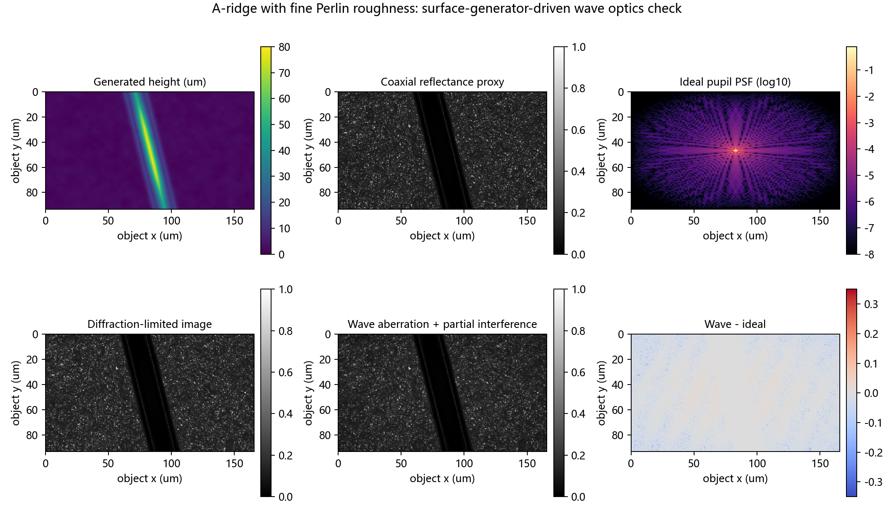
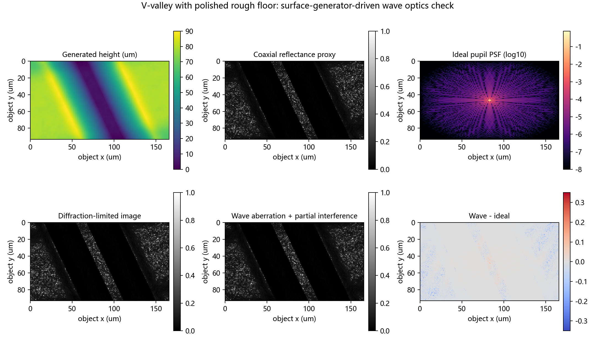
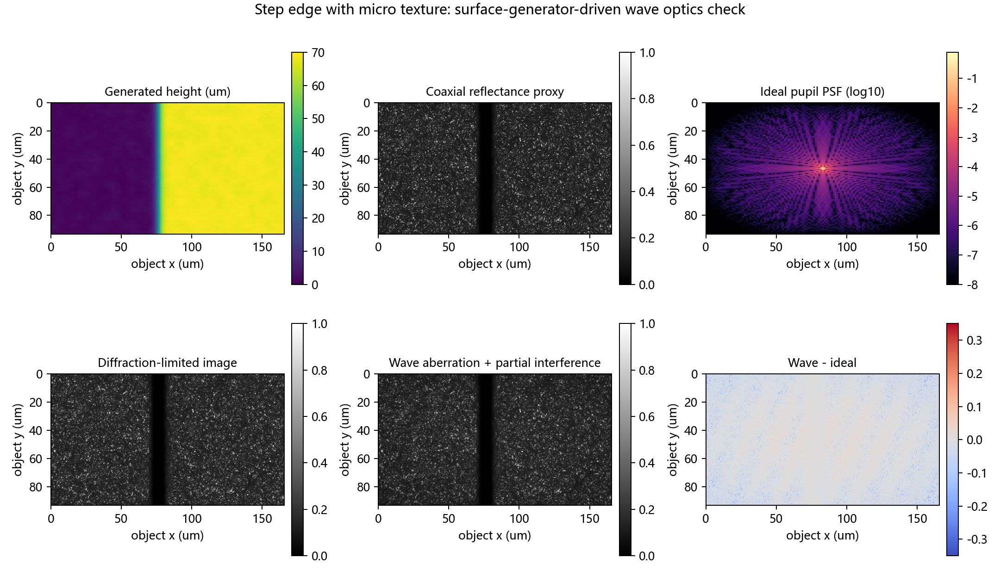

# 表面生成器驱动的波动光学像差验证计划与首轮模拟

## 结论

本轮已把项目已有 `src/surface_sample_generator.py` 接入波动光学验证流程。生成表面被缩放到 20X 工业相机下约 **165.6 um × 93.2 um** 的物方面视场，物方采样为 **0.173 um/pixel**，与 525 nm、NA=0.40 的衍射极限估算处在同一尺度。三类结构分别覆盖 A 型刃脊、V 谷和阶跃边缘，均来自现有表面生成器的 baseline + Perlin roughness 能力。

模拟结果说明：当表面反射相位项 `4πh/λ`、弱部分相干调制、defocus/astigmatism/coma/spherical aberration 的 pupil phase 同时存在时，理想衍射图与像差图之间会出现结构相关差分。差分集中在高反射边缘、刃脊肩部、谷底转折和阶跃附近，适合用作后续“真实样本 halo / 晕影 / 焦点评价异常”的机制验证材料。

## 参数对齐

- 波长：lambda = 0.525 um。
- 数值孔径：NA = 0.40。
- 放大倍率：20X。
- 假设相机像元：3.45 um，对应物方 0.173 um/pixel。
- 图像尺寸：960 × 540，对应物方视场 165.6 um × 93.2 um。
- 表面高度范围：70-90 um，用于贴合真实微缺陷的局部高度变化；相位扰动使用 0.035-0.045 的缩放系数，避免把宏观高度全量直接代入反射相位导致非物理高频振荡。

## 首轮指标

| case_id                 |   height_range_um |   slope_p95 |   wave_difference_p95_abs |   wave_difference_rms |   ideal_to_wave_corr |
|:------------------------|------------------:|------------:|--------------------------:|----------------------:|---------------------:|
| a_ridge_fine_perlin     |           80.0000 |      7.6809 |                    0.0471 |                0.0281 |               0.9868 |
| v_valley_polished_floor |           90.0000 |      2.9375 |                    0.0266 |                0.0218 |               0.9909 |
| step_micro_texture      |           70.0000 |      2.3646 |                    0.0550 |                0.0299 |               0.9865 |

## 图像结果

- a_ridge_fine_perlin: 
- v_valley_polished_floor: 
- step_micro_texture: 

## 后续可执行方案

1. 用真实样本标尺校准 `FOV_WIDTH_UM`、相机像元、物镜 NA 和焦层间距，把当前假设参数替换成实测 metadata。
2. 从真实图像中裁出 3-5 个 ROI，对齐 A 型刃脊、V 谷、阶跃、孔边缘和周期纹理五类结构。
3. 调整 `optical_height_scale_um`、`coherence_visibility` 和 pupil phase 系数，使模拟差分的空间频率、halo 宽度和边缘拖尾与真实 ROI 接近。
4. 将 `wave_difference_p95_abs`、`ideal_to_wave_corr`、高反射区域差分均值、焦点评价峰偏移作为像差敏感性指标。
5. 投稿表述保持为“surface-generator-driven wave-optics consistency check”，用于支持机理解释和仿真可信度，不直接替代真实 PSF / MTF 标定。
